# Design Document: Dajaj Ecosystem

## Overview

The Dajaj Ecosystem transforms the existing single-channel web POS into a unified multi-channel restaurant platform. The architecture introduces a native Android POS application as the primary point-of-sale and print node, retains the Next.js web application for menu management, inventory, customer ordering, and administration, and uses Firebase Firestore as the sole communication backbone between all clients.

### System Boundary

| Component | Technology | Role |
|-----------|-----------|------|
| Android POS | Kotlin, XML, MVVM, Hilt, Room, Firebase | Cashier operations, Bluetooth printing, KOT workflow |
| Web Dashboard | Next.js (existing) | Menu Builder, Inventory, Reports, Online Menu, Admin |
| Customer Website | Next.js (existing) | Browse menu, cart, order via WhatsApp |
| Backend | Firebase Firestore | Real-time sync, security rules, all inter-client communication |
| Printing | Bluetooth thermal printers | KOT, Customer Bill, Reprint via Android Print Agent |

### High-Level Architecture Diagram

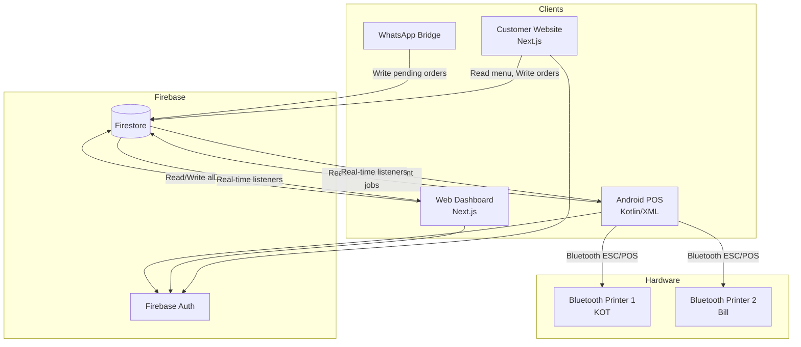
```mermaid
graph TB
    subgraph "Clients"
        CW[Customer Website<br/>Next.js]
        WD[Web Dashboard<br/>Next.js]
        AP[Android POS<br/>Kotlin/XML]
        WA[WhatsApp Bridge]
    end

    subgraph "Firebase"
        FS[(Firestore)]
        FA[Firebase Auth]
    end

    subgraph "Hardware"
        BP1[Bluetooth Printer 1<br/>KOT]
        BP2[Bluetooth Printer 2<br/>Bill]
    end

    CW -->|Read menu, Write orders| FS
    WD -->|Read/Write all| FS
    AP -->|Read/Write orders, print jobs| FS
    WA -->|Write pending orders| FS
    
    CW --> FA
    WD --> FA
    AP --> FA

    AP -->|Bluetooth ESC/POS| BP1
    AP -->|Bluetooth ESC/POS| BP2

    FS -->|Real-time listeners| AP
    FS -->|Real-time listeners| WD
```

### Design Principles

1. **Firestore as Single Source of Truth** — No direct client-to-client communication. All data flows through Firestore.
2. **Offline-First Android** — The POS must operate during internet outages using Room Database as local cache.
3. **Print Queue Pattern** — All printing goes through a Firestore-backed queue; never print directly from UI.
4. **Clean Architecture** — Android follows MVVM + Clean Architecture with clear layer boundaries.
5. **Zero-Downtime Migration** — The web POS is removed only after the Android POS is fully validated in production.

---

## Architecture

### Android Application Architecture

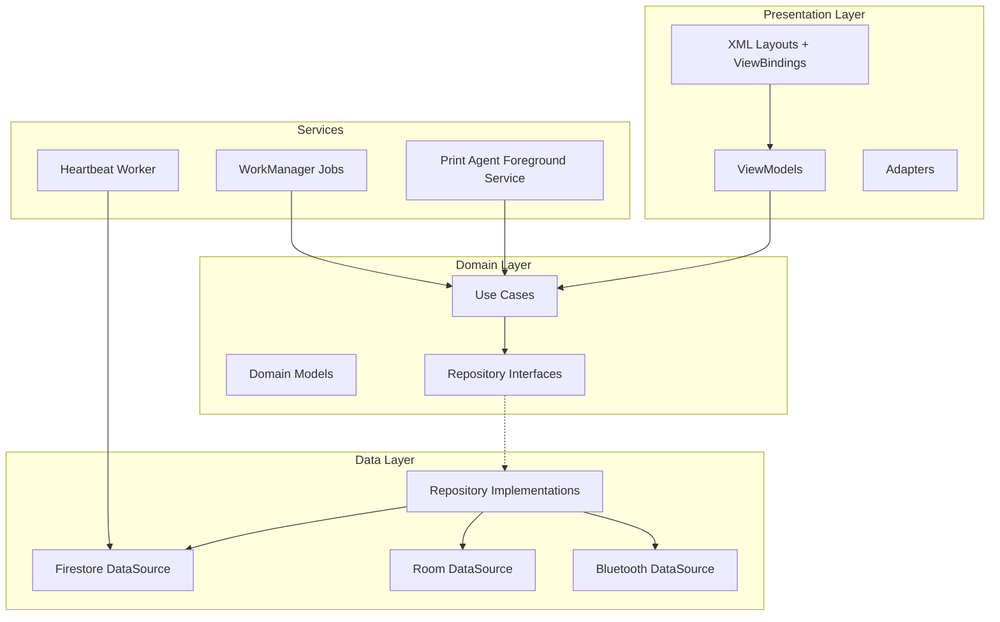
```mermaid
graph TB
    subgraph "Presentation Layer"
        UI[XML Layouts + ViewBindings]
        VM[ViewModels]
        AD[Adapters]
    end

    subgraph "Domain Layer"
        UC[Use Cases]
        DM[Domain Models]
        RI[Repository Interfaces]
    end

    subgraph "Data Layer"
        REPO[Repository Implementations]
        FS_DS[Firestore DataSource]
        ROOM_DS[Room DataSource]
        BT_DS[Bluetooth DataSource]
    end

    subgraph "Services"
        FGS[Print Agent Foreground Service]
        WM[WorkManager Jobs]
        HB[Heartbeat Worker]
    end

    UI --> VM
    VM --> UC
    UC --> RI
    RI -.-> REPO
    REPO --> FS_DS
    REPO --> ROOM_DS
    REPO --> BT_DS

    FGS --> UC
    WM --> UC
    HB --> FS_DS
```

### Module Structure

```
dajaj-android/
├── app/                          # Application module (DI, navigation, activities)
├── feature-pos/                  # POS screen, cart, order creation
├── feature-pending-orders/       # Pending orders list and acceptance
├── feature-kitchen/              # Kitchen preparation queue
├── feature-reports/              # Sales reports display
├── feature-settings/             # Printer settings, device management
├── core-domain/                  # Use cases, domain models, repository interfaces
├── core-data/                    # Repository implementations, Firestore/Room data sources
├── core-bluetooth/               # Bluetooth printer communication (isolated module)
├── core-print-agent/             # Foreground service, print queue processing
├── core-ui/                      # Shared UI components, themes, styles
└── core-common/                  # Utilities, extensions, constants
```

### Dependency Injection Graph (Hilt)

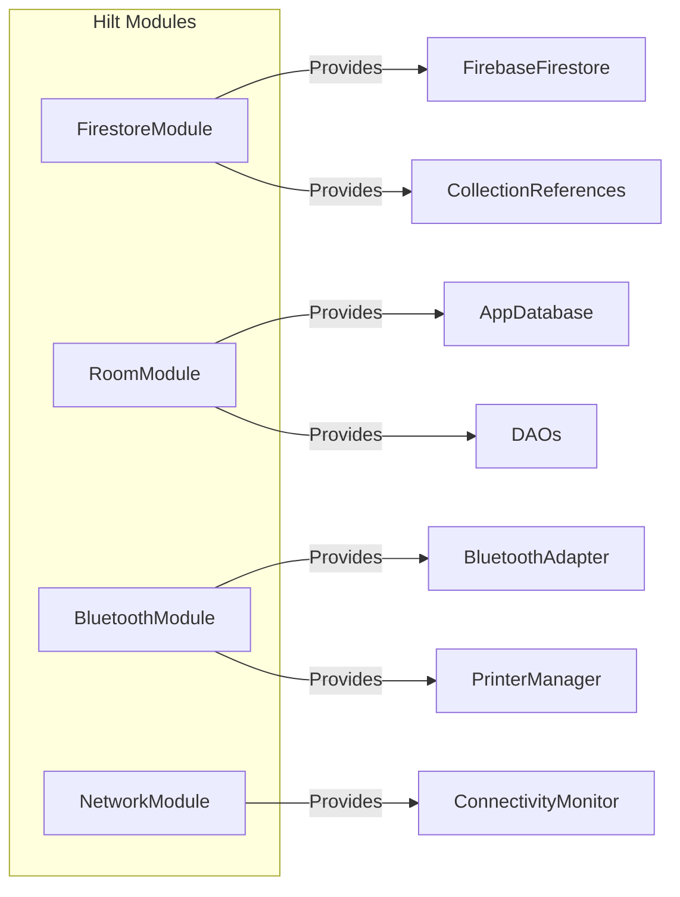
```mermaid
graph LR
    subgraph "Hilt Modules"
        FM[FirestoreModule]
        RM[RoomModule]
        BM[BluetoothModule]
        NM[NetworkModule]
    end

    FM -->|Provides| FirebaseFirestore
    FM -->|Provides| CollectionReferences
    RM -->|Provides| AppDatabase
    RM -->|Provides| DAOs
    BM -->|Provides| BluetoothAdapter
    BM -->|Provides| PrinterManager
    NM -->|Provides| ConnectivityMonitor
```

### Web Application Retained Architecture

The existing Next.js application retains:
- `/admin/menu-builder` — Menu Builder (CRUD on `menus` collection)
- `/admin/inventory` — Inventory Management
- `/admin/orders` — Delivery order tracking
- `/admin/sales` — Sales reports
- `/admin/riders` — Rider management
- `/admin/delivery` — Delivery settings
- `/menu` — Customer-facing online menu
- `/checkout` — Customer checkout flow
- `/login` — Customer authentication
- API routes: `/api/auth/*`, `/api/inventory/*`, `/api/webhooks/*`

Removed after migration:
- `/pos`, `/pos/login`, `/admin/pos`, `/bill`, `/bills`
- Associated components: POS screen, cashier interface, billing modals
- Associated libraries: POS-specific functions in `lib/firestore.ts`

---

## Components and Interfaces

### 1. Android UI Specification

#### 1.1 Authentication Screen

**Purpose:** Authenticate cashiers and managers to access the Android POS.

**Layout:** Portrait, single Activity with fragment navigation.

**Components:**
- App logo and brand name ("DAJAJ POS")
- Email input field (TextInputLayout, type: email)
- Password input field (TextInputLayout, type: password, toggle visibility)
- "Sign In" primary button (MaterialButton, filled)
- "Forgot Password" text link
- Loading progress indicator (CircularProgressIndicator)
- Error message area (TextView, red)

**User Actions:**
| Action | Behavior |
|--------|----------|
| Enter credentials + tap Sign In | Authenticate via Firebase Auth, validate POS staff profile, navigate to Dashboard |
| Tap Forgot Password | Send Firebase password reset email, show confirmation snackbar |
| Submit empty fields | Show inline validation errors |
| Network unavailable | Show "No internet connection" error, retain entered data |

**Validation Rules:**
- Email: non-empty, valid email format
- Password: non-empty, minimum 6 characters
- Role: must have `pos_staff` document with `status: active`

**Error Handling:**
- Invalid credentials → "Invalid email or password"
- Account pending → "Your account is pending approval"
- Account rejected → "Access denied. Contact administrator"
- Network error → "Unable to connect. Check your internet"

**Loading States:**
- Button shows CircularProgressIndicator, inputs disabled during auth

**Session Management:**
- Store Firebase Auth token in Android Keystore
- Auto-login on app restart if token is valid
- Token refresh handled by Firebase SDK
- Session expires after 30 days of inactivity

**Logout:**
- Available from Settings screen
- Clears local auth state, navigates to Login
- Does NOT clear cached menu data (Room Database)

#### 1.2 Dashboard Screen

**Purpose:** Main navigation hub after login. Shows system status at a glance.

**Layout:** Portrait or Landscape, GridLayout of action cards.

**Components:**
- Header: Restaurant name, cashier name, current date/time
- Status bar: Internet indicator (green/red dot), Printer indicator (green/yellow/red), Device name
- Navigation grid (2x3):
  - **New Order** — Opens POS screen
  - **Pending Orders** — Badge shows count of pending orders
  - **Kitchen** — Badge shows preparing count
  - **Reports** — Daily summary
  - **Settings** — Printer, device, account
  - **Bills** — Today's completed bills

**User Actions:**
| Action | Behavior |
|--------|----------|
| Tap New Order | Navigate to POS screen (landscape) |
| Tap Pending Orders | Navigate to Pending Orders list |
| Tap Kitchen | Navigate to Kitchen queue |
| Tap Reports | Navigate to Reports |
| Tap Settings | Navigate to Settings |
| Tap Bills | Navigate to today's bills list |

**Status Indicators:**
- Internet: `ONLINE` (green) / `OFFLINE` (red) — updates within 2 seconds
- Printer: `CONNECTED` (green) / `RECONNECTING` (yellow) / `DISCONNECTED` (red)
- Pending count: Real-time badge from Firestore listener

**Empty State:** First launch after login shows all badges at zero.

**Accessibility:**
- All cards have `contentDescription` for screen readers
- Touch targets minimum 48dp
- Color indicators supplemented with text labels

#### 1.3 POS Screen (Cashier)

**Purpose:** Create walk-in, takeaway, and dine-in orders. Primary workflow screen.

**Layout:** Landscape ONLY. Three-panel split layout.

```
┌─────────────┬──────────────────────────┬─────────────────┐
│  Categories │      Menu Items           │     Cart        │
│  (Left)     │      (Center)            │     (Right)     │
│  200dp      │      flex                │     320dp       │
│             │                          │                 │
│ ★ Favorites │  [Item] [Item] [Item]    │ Order #1234     │
│ Alfaham     │  [Item] [Item] [Item]    │ ─────────────── │
│ Shawarma    │  [Item] [Item] [Item]    │ 1x Regular Qtr  │
│ Grill       │                          │    ₹120         │
│ Tandoor     │                          │ 2x Peri Peri    │
│ Breads      │                          │    ₹120         │
│ Drinks      │                          │ ─────────────── │
│             │                          │ Subtotal: ₹360  │
│             │                          │ ─────────────── │
│             │                          │ [Walk-in] [T/A] │
│             │                          │ [Confirm Order] │
└─────────────┴──────────────────────────┴─────────────────┘
```

**Left Panel — Categories (200dp fixed width):**
- RecyclerView with vertical list
- First item always "★ Favorites"
- Categories fetched from Room DB (cached from Firestore)
- Selected category highlighted with accent color
- Scroll if more categories than viewport

**Center Panel — Menu Items (flexible width):**
- GridLayoutManager, 3–4 columns depending on screen width
- Each item card shows: name, variant label, price, availability badge
- Unavailable items shown grayed out, non-tappable
- Search bar at top (filters items by name across all categories)
- Pull-to-refresh syncs from Firestore

**Right Panel — Cart (320dp fixed width):**
- Order label at top (auto-generated: DDMMYY####)
- ScrollView of cart items
- Each cart item shows: quantity (- / +), name, variant, modifiers, line total
- Remove button (swipe-to-delete or X icon)
- Subtotal, taxes (CGST/SGST), grand total
- Order type selector: Walk-in / Takeaway / Dine-in (RadioGroup or SegmentedButton)
- "Confirm Order" button (disabled until order type selected and cart non-empty)
- "Clear Cart" secondary button

**User Actions:**
| Action | Behavior |
|--------|----------|
| Tap category | Load items for category in center panel (<200ms) |
| Tap menu item | Add to cart with qty 1, show modifier dialog if modifiers exist |
| Tap + on cart item | Increment quantity |
| Tap - on cart item | Decrement quantity (minimum 1, or remove if 0) |
| Swipe cart item | Remove from cart |
| Select order type | Enable Confirm Order button |
| Tap Confirm Order | Create order in Firestore, generate KOT print job, show bill summary |
| Tap Clear Cart | Confirmation dialog, then clear all items |
| Search input | Filter visible items by name (case-insensitive) |

**Modifier Dialog:**
- Modal BottomSheetDialogFragment
- Shows modifier groups with selection type (single/multiple)
- Enforces min/max selection per group
- Shows price adjustments
- "Add to Cart" button at bottom

**Validation Rules:**
- Cart must have ≥1 item to confirm
- Order type must be selected
- All required modifier groups must have valid selection
- Item must be available (isAvailable: true)

**Error Handling:**
- Firestore write failure → Retry with exponential backoff, show snackbar
- Print failure → Order still confirmed, print job queued for retry
- Offline → Order saved to Room DB, synced when online

**Loading States:**
- Category switch: Shimmer placeholder for 200ms max
- Order confirmation: Full-screen loading overlay with "Creating order..."

**Empty States:**
- No items in category: "No items available in this category"
- Empty cart: "Tap items to add to your order"
- No categories: "Menu not loaded. Pull to refresh"

**Accessibility:**
- All touch targets ≥48dp
- Contrast ratio ≥4.5:1 for all text
- Cart item quantities announced via AccessibilityEvent
- Order type selection uses RadioButton for screen reader compatibility

#### 1.4 Pending Orders Screen

**Purpose:** Display and manage incoming orders from all channels.

**Layout:** Portrait or Landscape. Single-column list.

**Components:**
- Tab bar: All / WhatsApp / Website / QR (future)
- RecyclerView of pending order cards
- Each card shows: Order #, source channel icon, customer name, item count, total, elapsed time
- Accept button (green), Reject button (red) per card
- Pull-to-refresh
- Real-time update indicator

**User Actions:**
| Action | Behavior |
|--------|----------|
| Tap Accept | Convert to POS order, auto-generate KOT, print |
| Tap Reject | Show rejection reason dialog (1–200 chars), update to REJECTED |
| Tap card body | Expand to show full item details |
| Pull down | Force re-sync from Firestore |
| Filter by tab | Show only orders from selected channel |

**Order Card Layout:**
```
┌──────────────────────────────────────────┐
│ 📱 WhatsApp  •  Order #1045  •  2m ago   │
│ Customer: Ahmed                          │
│ Items: 3 items  •  Total: ₹450          │
│                                          │
│        [✓ Accept]    [✗ Reject]          │
└──────────────────────────────────────────┘
```

**Error Handling:**
- Accept fails (menu item unavailable) → Show error, retain as PENDING
- Firestore listener disconnects → Show yellow banner "Reconnecting..."
- Offline → Show cached pending orders (read-only, no accept/reject)

**Empty State:** "No pending orders. Orders from all channels will appear here."

#### 1.5 Kitchen Screen

**Purpose:** Display orders in preparation with timing and FIFO ordering.

**Layout:** Portrait or Landscape. Card list sorted oldest-first.

**Components:**
- Header with count of orders in PREPARING state
- RecyclerView of kitchen order cards
- Each card: Order #, items with quantities, special notes, elapsed timer, overdue indicator
- "Mark Ready" button per card
- Audio alert when order is marked ready

**Kitchen Card Layout:**
```
┌──────────────────────────────────────────┐
│ Order #1045          ⏱ 12:34 elapsed     │
│ ─────────────────────────────────────── │
│ 2x Regular Alfaham Qtr                  │
│ 1x Peri Peri Shawarma Roll              │
│ Notes: "Extra spicy, no onion"          │
│                                          │
│              [✓ Mark Ready]              │
└──────────────────────────────────────────┘
```

**Overdue Indicator:** Red border + "OVERDUE" badge after 30 minutes in PREPARING.

**User Actions:**
| Action | Behavior |
|--------|----------|
| Tap Mark Ready | Transition to READY, update Firestore, play alert sound, notify cashier |
| View order | Read-only, no editing from kitchen |

**Empty State:** "Kitchen is clear. New orders will appear when accepted."

#### 1.6 Reports Screen

**Purpose:** Display daily sales summary on Android POS.

**Layout:** Portrait. Scrollable summary cards.

**Components:**
- Date picker (defaults to today)
- Summary card: Total orders, Total revenue, Average order value
- Channel breakdown: Walk-in, WhatsApp, Website counts and revenue
- Peak hour indicator
- Bill list for selected date

**Note:** Full reporting is on Web Dashboard. Android shows daily quick-view only.

#### 1.7 Printer Settings Screen

**Purpose:** Manage Bluetooth printer connections and test printing.

**Layout:** Portrait. Settings list.

**Components:**
- "Scan for Printers" button
- Paired printers list with status indicators
- For each printer: Name, MAC address, status (Connected/Disconnected/Reconnecting)
- Actions per printer: Connect, Disconnect, Test Print, Set as KOT Printer, Set as Bill Printer
- "Add Printer" workflow (scan → select → pair → test)

**User Actions:**
| Action | Behavior |
|--------|----------|
| Tap Scan | Start Bluetooth discovery for 15 seconds |
| Tap discovered printer | Initiate pairing |
| Tap Connect | Connect to paired printer |
| Tap Test Print | Send test page, confirm success/failure within 10s |
| Tap Set as KOT | Designate printer for KOT jobs |
| Tap Set as Bill | Designate printer for bill jobs |

**Error Handling:**
- No printers found → "No printers found. Ensure printer is powered on and in pairing mode"
- Pairing failed → "Pairing failed. Try again"
- Test print failed → "Print failed. Check printer connection"
- Bluetooth disabled → Show system dialog to enable Bluetooth

---

### 2. Navigation Architecture

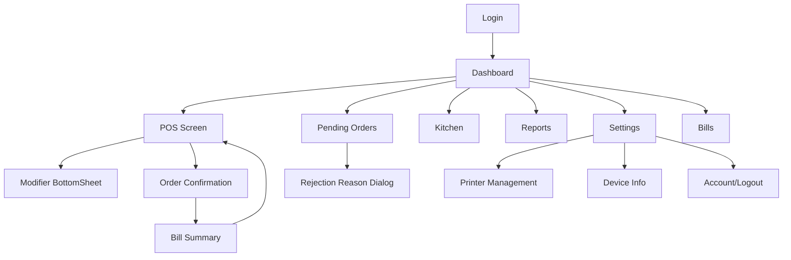
```mermaid
graph TD
    Login --> Dashboard
    Dashboard --> POS[POS Screen]
    Dashboard --> PO[Pending Orders]
    Dashboard --> Kitchen
    Dashboard --> Reports
    Dashboard --> Settings
    Dashboard --> Bills
    
    POS --> ModifierDialog[Modifier BottomSheet]
    POS --> OrderConfirm[Order Confirmation]
    
    PO --> RejectDialog[Rejection Reason Dialog]
    
    Settings --> PrinterSettings[Printer Management]
    Settings --> DeviceSettings[Device Info]
    Settings --> AccountSettings[Account/Logout]
    
    OrderConfirm --> BillSummary[Bill Summary]
    BillSummary --> POS
```

**Navigation Component:** AndroidX Navigation Component with NavGraph.

**Activity Structure:**
- `AuthActivity` — Login flow (portrait)
- `MainActivity` — All post-auth screens (supports landscape for POS)

---


## Data Models

### Firestore Collections Architecture

```mermaid
erDiagram
    MENUS ||--o{ MENUS : "parentId"
    ORDERS ||--o{ ORDER_ITEMS : contains
    PENDING_ORDERS ||--o{ ORDER_ITEMS : contains
    PRINT_JOBS }o--|| ORDERS : "references"
    PRINT_JOBS }o--|| DEVICES : "claimedBy"
    DEVICES }o--|| USERS : "userId"
    BILLS ||--o{ BILL_ITEMS : contains
    COUNTERS ||--|| COUNTERS : "atomic sequences"

    MENUS {
        string id PK
        string name
        string parentId FK
        string type "category|variant|modifierGroup|modifier"
        number price
        string selectionType
        number minSelection
        number maxSelection
        string description
        string imageUrl
        boolean isAvailable
        boolean trackInventory
        number inventoryMultiplier
        string inventoryTrackingMode
        number order
        timestamp createdAt
        timestamp updatedAt
    }

    ORDERS {
        string id PK
        string restaurantId
        string orderNumber
        string channel "walk_in|whatsapp|website|qr|swiggy|zomato"
        string type "walk_in|takeaway|dine_in"
        string status "pending|accepted|preparing|ready|completed|cancelled"
        string customerId
        string customerName
        string customerPhone
        array items
        number subtotal
        number cgst
        number sgst
        number grandTotal
        string paymentMode
        string cashierId
        string rejectionReason
        timestamp createdAt
        timestamp updatedAt
        timestamp acceptedAt
        timestamp preparingAt
        timestamp readyAt
        timestamp completedAt
    }

    PENDING_ORDERS {
        string id PK
        string restaurantId
        string orderNumber
        string channel "whatsapp|website|qr|swiggy|zomato"
        string status "pending|accepted|rejected"
        string customerName
        string customerPhone
        array items
        number total
        string rejectionReason
        timestamp createdAt
        timestamp processedAt
    }

    PRINT_JOBS {
        string id PK
        string restaurantId
        string jobType "kot|customer_bill|reprint"
        string printerType "kot|bill"
        string status "pending|processing|completed|failed"
        string claimedBy "deviceId"
        string orderId
        string orderNumber
        map payload
        number retryCount
        string failureReason
        string source "android_pos|web_dashboard"
        timestamp createdAt
        timestamp claimedAt
        timestamp completedAt
    }

    DEVICES {
        string id PK
        string restaurantId
        string deviceName
        string userId
        boolean isPrimaryPrinter
        string status "online|offline"
        map printerStatus
        timestamp lastHeartbeat
        timestamp registeredAt
    }

    USERS {
        string id PK
        string email
        string name
        string role "customer|cashier|manager|admin"
        string status "pending|active|rejected"
        boolean canManageInventory
        timestamp createdAt
        timestamp updatedAt
    }

    BILLS {
        string id PK
        string billNo
        string publicToken
        string restaurantId
        string orderNumber
        string orderType
        string channel
        array items
        number subtotal
        number cgst
        number sgst
        number grandTotal
        string paymentMode
        number cashCollected
        string punchedBy
        map customer
        timestamp createdAt
    }

    COUNTERS {
        string id PK "orders|bills|orders_DDMMYY"
        number current
        number value
    }
}
```

### Collection: `menus`

**Purpose:** Single source of truth for all menu definitions. Hierarchical tree structure using parentId references.

**Document Structure:**
```json
{
  "id": "abc123",
  "name": "Regular Alfaham",
  "parentId": "cat_alfaham",
  "type": "variant",
  "price": 120,
  "selectionType": "",
  "minSelection": 0,
  "maxSelection": 0,
  "description": "Classic alfaham preparation with signature spices",
  "imageUrl": "https://storage.googleapis.com/dajaj/alfaham-regular.jpg",
  "isAvailable": true,
  "trackInventory": true,
  "inventoryMultiplier": 1,
  "inventoryTrackingMode": null,
  "modifierMasterId": null,
  "order": 0,
  "createdAt": "2024-01-15T10:30:00.000Z",
  "updatedAt": "2024-01-15T10:30:00.000Z"
}
```

**Field Types & Validation:**
| Field | Type | Required | Validation |
|-------|------|----------|------------|
| id | string | Yes | Auto-generated Firestore doc ID |
| name | string | Yes | 1–100 characters |
| parentId | string \| null | Yes | Must reference existing doc or null for root |
| type | string | Yes | Enum: category, variant, modifierGroup, modifier |
| price | number | Yes | ≥0, only meaningful for variant/modifier |
| selectionType | string | Yes | Enum: single, multiple, "" |
| minSelection | number | Yes | ≥0, only for modifierGroup |
| maxSelection | number | Yes | ≥0, ≥minSelection if >0 |
| description | string | No | 0–500 characters |
| imageUrl | string | No | Valid URL or empty |
| isAvailable | boolean | Yes | Default: true |
| trackInventory | boolean | Yes | Only for variant and root category |
| inventoryMultiplier | number \| null | No | >0 when applicable |
| inventoryTrackingMode | string \| null | No | Enum: aggregate, items, null |
| order | number | Yes | ≥0, sibling sort order |
| createdAt | timestamp | Yes | Server timestamp |
| updatedAt | timestamp | Yes | Server timestamp |

**Indexes:**
- `parentId` + `order` (composite) — for fetching sorted children
- `type` + `isAvailable` (composite) — for filtering available variants
- `isAvailable` (single) — for customer-facing queries

**Security Rules:**
```
match /menus/{menuId} {
  allow read: if true;  // Public menu
  allow write: if request.auth != null && 
    get(/databases/$(database)/documents/users/$(request.auth.uid)).data.role in ['manager', 'admin'];
}
```

**Relationships:** Self-referencing via `parentId`. Tree depth: category → variant → modifierGroup → modifier.

**Lifecycle:** Created by Menu Builder. Never hard-deleted in production (set `isAvailable: false`). Tree deletion via batch writes.

**Queries Used:**
- Android POS: `onSnapshot(collection('menus'))` — full collection listener for cache
- Customer Website: `getDocs(collection('menus'))` — full fetch on page load
- Menu Builder: `onSnapshot(collection('menus'))` — real-time editing

**Read/Write Patterns:**
- Read: ~50 reads/minute (all clients combined)
- Write: ~5 writes/hour (menu changes are infrequent)

**Real-time Listener Requirements:**
- Android POS: Persistent listener for immediate menu sync
- Menu Builder: Persistent listener for collaborative editing
- Customer Website: Optional listener or periodic refresh

---

### Collection: `orders`

**Purpose:** All confirmed orders from all channels. Primary business data.

**Document Structure:**
```json
{
  "id": "1045",
  "restaurantId": "dajaj_main",
  "orderNumber": "1104260001",
  "channel": "walk_in",
  "type": "takeaway",
  "status": "preparing",
  "customerId": "",
  "customerName": "Walk-in Customer",
  "customerPhone": "",
  "items": [
    {
      "id": "item_001",
      "sku": "ALF-REG-QTR",
      "name": "Regular Alfaham",
      "variantLabel": "Quarter",
      "variantId": "var_abc123",
      "qty": 2,
      "basePrice": 120,
      "modifiers": [
        {
          "id": "mod_001",
          "name": "Extra Spicy",
          "price": 20,
          "groupName": "Spice Level"
        }
      ],
      "itemTotal": 280
    }
  ],
  "subtotal": 280,
  "cgst": 14,
  "sgst": 14,
  "grandTotal": 308,
  "paymentMode": "cash",
  "cashCollected": 350,
  "cashierId": "staff_ahmed",
  "rejectionReason": null,
  "createdAt": "2024-01-15T14:30:00.000Z",
  "updatedAt": "2024-01-15T14:32:00.000Z",
  "acceptedAt": "2024-01-15T14:30:05.000Z",
  "preparingAt": "2024-01-15T14:30:10.000Z",
  "readyAt": null,
  "completedAt": null
}
```

**Field Types & Validation:**
| Field | Type | Required | Validation |
|-------|------|----------|------------|
| id | string | Yes | Sequential numeric from counter |
| restaurantId | string | Yes | Non-empty |
| orderNumber | string | Yes | Format: DDMMYY#### |
| channel | string | Yes | Enum: walk_in, whatsapp, website, qr, swiggy, zomato |
| type | string | Yes | Enum: walk_in, takeaway, dine_in |
| status | string | Yes | Enum: pending, accepted, preparing, ready, completed, cancelled |
| items | array | Yes | ≥1 item |
| subtotal | number | Yes | >0 |
| cgst | number | Yes | ≥0 |
| sgst | number | Yes | ≥0 |
| grandTotal | number | Yes | = subtotal + cgst + sgst |
| paymentMode | string | Yes | Enum: cash, upi, card |
| cashierId | string | No | Staff ID who processed |
| createdAt | timestamp | Yes | Server timestamp |

**Indexes:**
- `restaurantId` + `status` + `createdAt` (composite) — for kitchen queue
- `restaurantId` + `createdAt` (composite) — for reports date range
- `restaurantId` + `channel` + `createdAt` (composite) — for channel reports
- `status` + `createdAt` (composite) — for pending/preparing queries

**Security Rules:**
```
match /orders/{orderId} {
  allow read: if request.auth != null;
  allow create: if request.auth != null;
  allow update: if request.auth != null && 
    get(/databases/$(database)/documents/users/$(request.auth.uid)).data.role in ['cashier', 'manager', 'admin'];
}
```

**Order Lifecycle:**

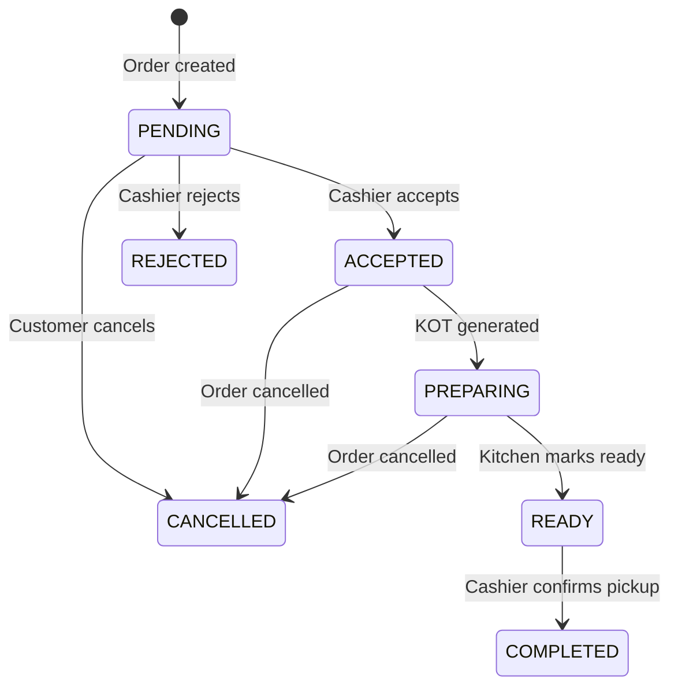
```mermaid
stateDiagram-v2
    [*] --> PENDING : Order created
    PENDING --> ACCEPTED : Cashier accepts
    PENDING --> REJECTED : Cashier rejects
    PENDING --> CANCELLED : Customer cancels
    ACCEPTED --> PREPARING : KOT generated
    PREPARING --> READY : Kitchen marks ready
    READY --> COMPLETED : Cashier confirms pickup
    ACCEPTED --> CANCELLED : Order cancelled
    PREPARING --> CANCELLED : Order cancelled
```

**Valid State Transitions:**
| From | To | Trigger |
|------|-----|---------|
| PENDING | ACCEPTED | Cashier accepts pending order |
| PENDING | REJECTED | Cashier rejects with reason |
| PENDING | CANCELLED | Customer/system cancellation |
| ACCEPTED | PREPARING | KOT print job created |
| PREPARING | READY | Kitchen marks order ready |
| READY | COMPLETED | Cashier confirms customer pickup |
| Any active | CANCELLED | Cancellation event |

---

### Collection: `pending_orders`

**Purpose:** Incoming orders from external channels awaiting cashier acceptance.

**Document Structure:**
```json
{
  "id": "po_abc123",
  "restaurantId": "dajaj_main",
  "orderNumber": "1045",
  "channel": "whatsapp",
  "status": "pending",
  "customerName": "Ahmed Khan",
  "customerPhone": "+919876543210",
  "items": [
    {
      "name": "Regular Alfaham Quarter",
      "qty": 2,
      "price": 120,
      "total": 240
    },
    {
      "name": "Peri Peri Shawarma Roll",
      "qty": 1,
      "price": 60,
      "total": 60
    }
  ],
  "total": 300,
  "notes": "Extra spicy please",
  "rejectionReason": null,
  "createdAt": "2024-01-15T14:25:00.000Z",
  "processedAt": null
}
```

**Indexes:**
- `restaurantId` + `status` + `createdAt` (composite) — for pending order list
- `channel` + `createdAt` (composite) — for channel filtering

**Security Rules:**
```
match /pending_orders/{orderId} {
  allow read: if request.auth != null;
  allow create: if true;  // Customers can create pending orders
  allow update: if request.auth != null && 
    get(/databases/$(database)/documents/users/$(request.auth.uid)).data.role in ['cashier', 'manager', 'admin'];
}
```

---

### Collection: `print_jobs`

**Purpose:** Queue for all print operations. Never print directly from UI.

**Document Structure:**
```json
{
  "id": "pj_xyz789",
  "restaurantId": "dajaj_main",
  "jobType": "kot",
  "printerType": "kot",
  "status": "pending",
  "claimedBy": null,
  "orderId": "1045",
  "orderNumber": "1104260001",
  "payload": {
    "header": "DAJAJ - Kitchen Order",
    "orderNumber": "1104260001",
    "orderType": "Takeaway",
    "time": "2024-01-15T14:30:00.000Z",
    "items": [
      {
        "name": "Regular Alfaham Qtr",
        "qty": 2,
        "modifiers": ["Extra Spicy"],
        "notes": ""
      }
    ],
    "specialNotes": "Rush order",
    "isReprint": false,
    "originalJobId": null
  },
  "retryCount": 0,
  "failureReason": null,
  "source": "android_pos",
  "createdAt": "2024-01-15T14:30:00.000Z",
  "claimedAt": null,
  "completedAt": null
}
```

**Print Job Lifecycle:**

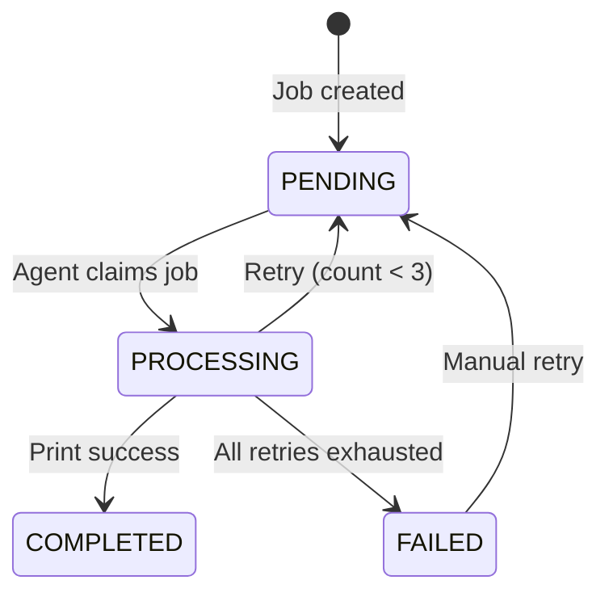
```mermaid
stateDiagram-v2
    [*] --> PENDING : Job created
    PENDING --> PROCESSING : Agent claims job
    PROCESSING --> COMPLETED : Print success
    PROCESSING --> PENDING : Retry (count < 3)
    PROCESSING --> FAILED : All retries exhausted
    FAILED --> PENDING : Manual retry
```

**Job Types & Payloads:**

| Job Type | Printer Type | Payload Contents |
|----------|-------------|-----------------|
| kot | kot | Order #, time, items with qty, modifiers, special notes |
| customer_bill | bill | Restaurant header, itemized list, tax breakdown, total, payment |
| reprint | kot or bill | Full original payload + "REPRINT" header + original job ID |

**Indexes:**
- `restaurantId` + `status` (composite) — for agent listener (PENDING jobs)
- `restaurantId` + `createdAt` (composite) — for job history
- `orderId` (single) — for finding jobs by order

**Security Rules:**
```
match /print_jobs/{jobId} {
  allow read: if request.auth != null;
  allow create: if request.auth != null;
  allow update: if request.auth != null && 
    get(/databases/$(database)/documents/users/$(request.auth.uid)).data.role in ['cashier', 'manager', 'admin'];
}
```

---

### Collection: `devices`

**Purpose:** Registry of connected Android POS devices for monitoring and primary printer designation.

**Document Structure:**
```json
{
  "id": "dev_samsung_tab_01",
  "restaurantId": "dajaj_main",
  "deviceName": "Counter POS 1",
  "userId": "staff_ahmed",
  "isPrimaryPrinter": true,
  "status": "online",
  "printerStatus": {
    "kotPrinter": {
      "name": "Epson TM-T82",
      "mac": "00:11:22:33:44:55",
      "status": "connected"
    },
    "billPrinter": {
      "name": "Star TSP143",
      "mac": "AA:BB:CC:DD:EE:FF",
      "status": "connected"
    }
  },
  "lastHeartbeat": "2024-01-15T14:30:00.000Z",
  "registeredAt": "2024-01-10T09:00:00.000Z",
  "appVersion": "1.0.0",
  "androidVersion": "13"
}
```

**Heartbeat Protocol:**
- Update `lastHeartbeat` every 30 seconds via WorkManager periodic task
- Device considered OFFLINE if `lastHeartbeat` > 90 seconds old
- Status evaluation performed by any reading client

**Indexes:**
- `restaurantId` + `status` (composite) — for active devices
- `restaurantId` + `isPrimaryPrinter` (composite) — for primary lookup

**Security Rules:**
```
match /devices/{deviceId} {
  allow read: if request.auth != null;
  allow write: if request.auth != null && 
    get(/databases/$(database)/documents/users/$(request.auth.uid)).data.role in ['cashier', 'manager', 'admin'];
}
```

---

### Collection: `bills`

**Purpose:** Generated bills for completed orders. Retained from existing system with enhanced fields.

**Document Structure:**
```json
{
  "billNo": "DAJAJ-000123",
  "publicToken": "a1b2c3d4-e5f6-7890-abcd-ef1234567890",
  "restaurantId": "dajaj_main",
  "orderNumber": "1104260001",
  "orderType": "takeaway",
  "channel": "walk_in",
  "items": [
    {
      "sku": "ALF-REG-QTR",
      "name": "Regular Alfaham",
      "variant": "Quarter",
      "qty": 2,
      "basePrice": 120,
      "addons": [
        { "name": "Spice Level: Extra Spicy", "price": 20 }
      ],
      "itemTotal": 280
    }
  ],
  "subtotal": 280,
  "cgst": 14,
  "sgst": 14,
  "grandTotal": 308,
  "paymentMode": "cash",
  "cashCollected": 350,
  "punchedBy": "Ahmed",
  "customer": {
    "name": "Walk-in",
    "mobile": ""
  },
  "createdAt": "2024-01-15T14:35:00.000Z"
}
```

**Indexes:**
- `restaurantId` + `createdAt` (composite) — for daily reports
- `billNo` (single) — for bill lookup
- `publicToken` (single) — for public bill access
- `channel` + `createdAt` (composite) — for channel reports

---

### Collection: `counters`

**Purpose:** Atomic sequential number generation for orders and bills.

**Documents:**
- `orders` — Global order counter (value: number)
- `bills` — Global bill counter (current: number)
- `orders_DDMMYY` — Daily order counter for POS labels (current: number)

**Usage:** Always accessed via `runTransaction()` for atomicity.

---

### Collection: `users` (extends existing `pos_staff`)

**Purpose:** User profiles with role-based access. Migrates from `pos_staff` to unified `users`.

**Document Structure:**
```json
{
  "id": "ahmed@dajaj.com",
  "uid": "firebase_auth_uid_123",
  "email": "ahmed@dajaj.com",
  "name": "Ahmed",
  "role": "cashier",
  "status": "active",
  "canManageInventory": false,
  "restaurantId": "dajaj_main",
  "createdAt": "2024-01-10T09:00:00.000Z",
  "updatedAt": "2024-01-15T14:00:00.000Z"
}
```

**Security Rules:**
```
match /users/{userId} {
  allow read: if request.auth != null && request.auth.uid == resource.data.uid;
  allow read: if request.auth != null && 
    get(/databases/$(database)/documents/users/$(request.auth.uid)).data.role in ['manager', 'admin'];
  allow write: if request.auth != null && 
    get(/databases/$(database)/documents/users/$(request.auth.uid)).data.role == 'admin';
}
```

---

### Menu Synchronization Flow

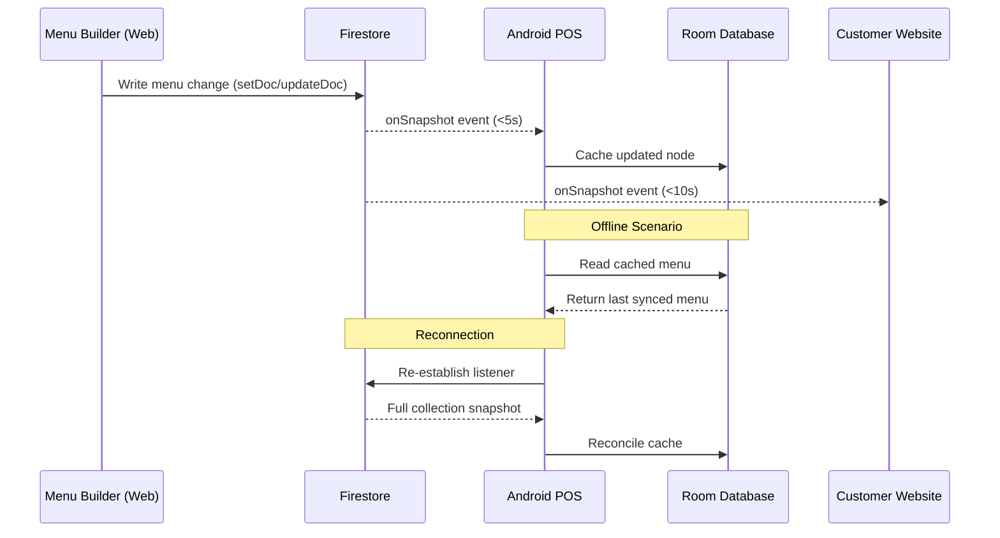
```mermaid
sequenceDiagram
    participant MB as Menu Builder (Web)
    participant FS as Firestore
    participant AP as Android POS
    participant Room as Room Database
    participant CW as Customer Website

    MB->>FS: Write menu change (setDoc/updateDoc)
    FS-->>AP: onSnapshot event (<5s)
    AP->>Room: Cache updated node
    FS-->>CW: onSnapshot event (<10s)
    
    Note over AP,Room: Offline Scenario
    AP->>Room: Read cached menu
    Room-->>AP: Return last synced menu
    
    Note over AP,FS: Reconnection
    AP->>FS: Re-establish listener
    FS-->>AP: Full collection snapshot
    AP->>Room: Reconcile cache
```

---


## Print Node Architecture

### Overview

The Android POS serves as the **Primary Print Node** in the ecosystem. All print operations — whether initiated from the Android POS, Web Dashboard, or future clients — flow through Firestore to the Print Agent running as a Foreground Service on the Android device. No client communicates directly with Bluetooth printers except the Print Agent.

### Architecture Diagram

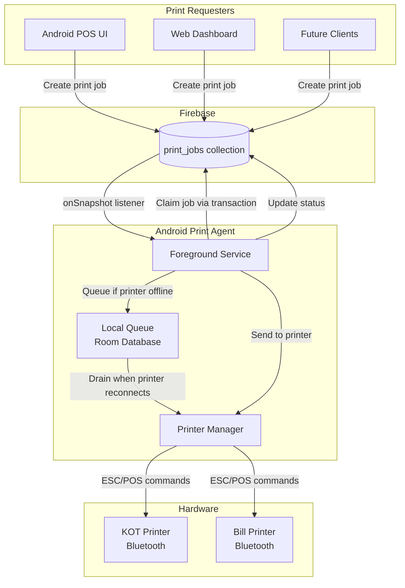
```mermaid
graph TB
    subgraph "Print Requesters"
        AP_UI[Android POS UI]
        WD[Web Dashboard]
        FUTURE[Future Clients]
    end

    subgraph "Firebase"
        PJ[(print_jobs collection)]
    end

    subgraph "Android Print Agent"
        FGS[Foreground Service]
        LQ[Local Queue<br/>Room Database]
        PM[Printer Manager]
    end

    subgraph "Hardware"
        KOT_P[KOT Printer<br/>Bluetooth]
        BILL_P[Bill Printer<br/>Bluetooth]
    end

    AP_UI -->|Create print job| PJ
    WD -->|Create print job| PJ
    FUTURE -->|Create print job| PJ

    PJ -->|onSnapshot listener| FGS
    FGS -->|Claim job via transaction| PJ
    FGS -->|Queue if printer offline| LQ
    LQ -->|Drain when printer reconnects| PM
    FGS -->|Send to printer| PM
    PM -->|ESC/POS commands| KOT_P
    PM -->|ESC/POS commands| BILL_P
    FGS -->|Update status| PJ
```

### Device Registry & Heartbeat System

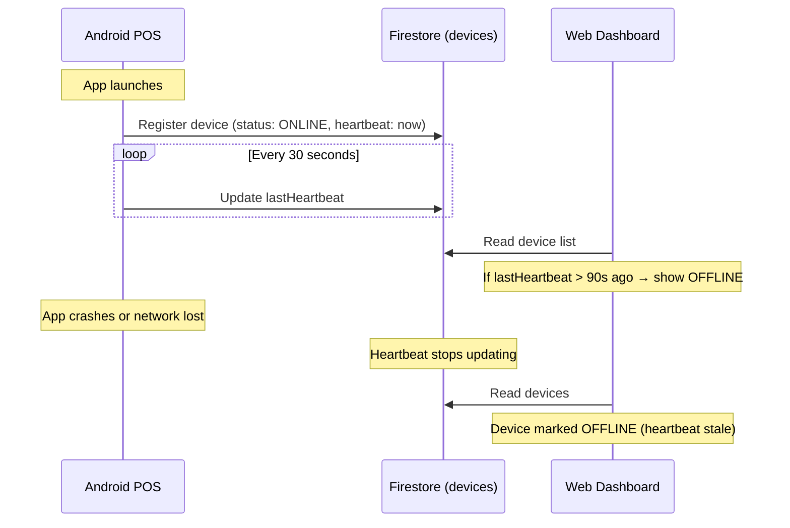
```mermaid
sequenceDiagram
    participant AP as Android POS
    participant FS as Firestore (devices)
    participant WD as Web Dashboard

    Note over AP: App launches
    AP->>FS: Register device (status: ONLINE, heartbeat: now)
    
    loop Every 30 seconds
        AP->>FS: Update lastHeartbeat
    end

    WD->>FS: Read device list
    Note over WD: If lastHeartbeat > 90s ago → show OFFLINE

    Note over AP: App crashes or network lost
    Note over FS: Heartbeat stops updating
    WD->>FS: Read devices
    Note over WD: Device marked OFFLINE (heartbeat stale)
```

### Primary Printer Designation

- Exactly ONE device is `isPrimaryPrinter: true` at any time
- Enforced via Firestore transaction (check-then-set)
- If primary goes OFFLINE, it stays unassigned until manual re-designation
- Non-primary devices do NOT process print jobs (they ignore the listener)

### Print Job Processing Sequence

#### Scenario 1: Cashier Prints KOT

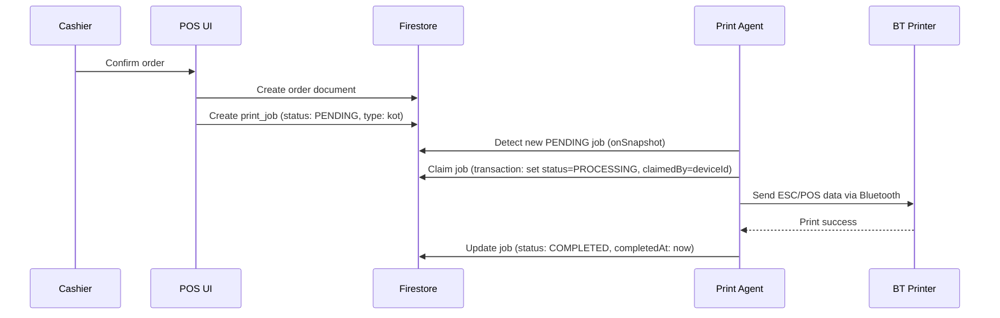
```mermaid
sequenceDiagram
    participant Cashier as Cashier
    participant UI as POS UI
    participant FS as Firestore
    participant Agent as Print Agent
    participant Printer as BT Printer

    Cashier->>UI: Confirm order
    UI->>FS: Create order document
    UI->>FS: Create print_job (status: PENDING, type: kot)
    Agent->>FS: Detect new PENDING job (onSnapshot)
    Agent->>FS: Claim job (transaction: set status=PROCESSING, claimedBy=deviceId)
    Agent->>Printer: Send ESC/POS data via Bluetooth
    Printer-->>Agent: Print success
    Agent->>FS: Update job (status: COMPLETED, completedAt: now)
```

#### Scenario 2: Manager Requests Reprint (Remote)

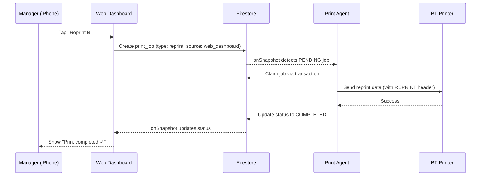
```mermaid
sequenceDiagram
    participant Manager as Manager (iPhone)
    participant WD as Web Dashboard
    participant FS as Firestore
    participant Agent as Print Agent
    participant Printer as BT Printer

    Manager->>WD: Tap "Reprint Bill #123"
    WD->>FS: Create print_job (type: reprint, source: web_dashboard)
    FS-->>Agent: onSnapshot detects PENDING job
    Agent->>FS: Claim job via transaction
    Agent->>Printer: Send reprint data (with REPRINT header)
    Printer-->>Agent: Success
    Agent->>FS: Update status to COMPLETED
    FS-->>WD: onSnapshot updates status
    WD-->>Manager: Show "Print completed ✓"
```

#### Scenario 3: Printer Disconnects Mid-Print

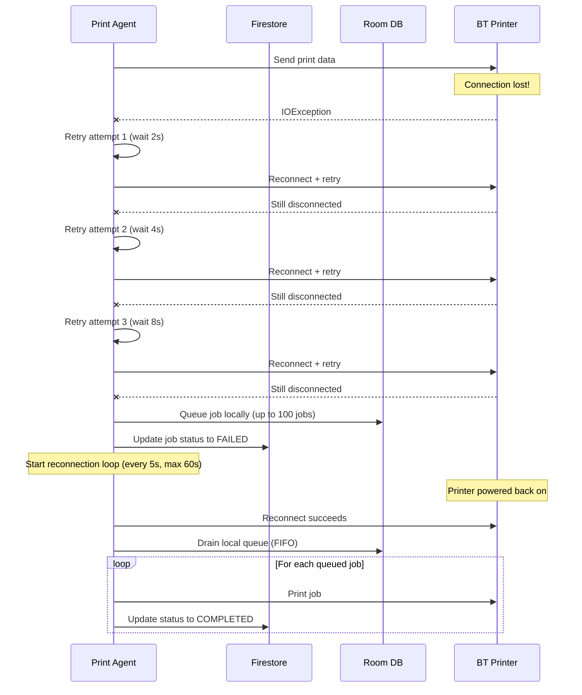
```mermaid
sequenceDiagram
    participant Agent as Print Agent
    participant FS as Firestore
    participant Room as Room DB
    participant Printer as BT Printer

    Agent->>Printer: Send print data
    Note over Printer: Connection lost!
    Printer--xAgent: IOException

    Agent->>Agent: Retry attempt 1 (wait 2s)
    Agent->>Printer: Reconnect + retry
    Printer--xAgent: Still disconnected

    Agent->>Agent: Retry attempt 2 (wait 4s)
    Agent->>Printer: Reconnect + retry
    Printer--xAgent: Still disconnected

    Agent->>Agent: Retry attempt 3 (wait 8s)
    Agent->>Printer: Reconnect + retry
    Printer--xAgent: Still disconnected

    Agent->>Room: Queue job locally (up to 100 jobs)
    Agent->>FS: Update job status to FAILED

    Note over Agent: Start reconnection loop (every 5s, max 60s)
    
    Note over Printer: Printer powered back on
    Agent->>Printer: Reconnect succeeds
    Agent->>Room: Drain local queue (FIFO)
    loop For each queued job
        Agent->>Printer: Print job
        Agent->>FS: Update status to COMPLETED
    end
```

#### Scenario 4: Internet Disconnects

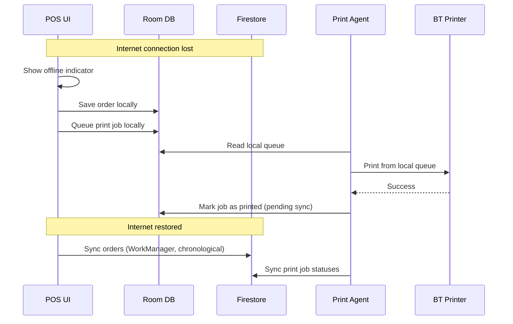
```mermaid
sequenceDiagram
    participant UI as POS UI
    participant Room as Room DB
    participant FS as Firestore
    participant Agent as Print Agent
    participant Printer as BT Printer

    Note over UI,FS: Internet connection lost
    UI->>UI: Show offline indicator
    
    UI->>Room: Save order locally
    UI->>Room: Queue print job locally
    Agent->>Room: Read local queue
    Agent->>Printer: Print from local queue
    Printer-->>Agent: Success
    Agent->>Room: Mark job as printed (pending sync)

    Note over UI,FS: Internet restored
    UI->>FS: Sync orders (WorkManager, chronological)
    Agent->>FS: Sync print job statuses
```

#### Scenario 5: Android Device Restarts

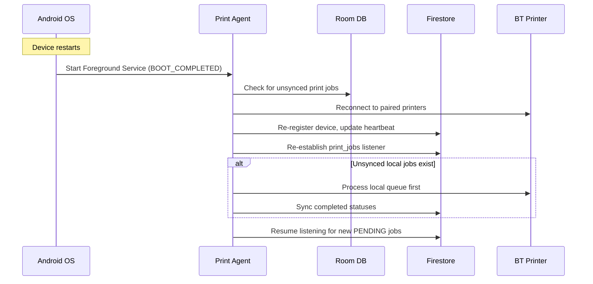
```mermaid
sequenceDiagram
    participant OS as Android OS
    participant Agent as Print Agent
    participant Room as Room DB
    participant FS as Firestore
    participant Printer as BT Printer

    Note over OS: Device restarts
    OS->>Agent: Start Foreground Service (BOOT_COMPLETED)
    Agent->>Room: Check for unsynced print jobs
    Agent->>Printer: Reconnect to paired printers
    Agent->>FS: Re-register device, update heartbeat
    Agent->>FS: Re-establish print_jobs listener
    
    alt Unsynced local jobs exist
        Agent->>Printer: Process local queue first
        Agent->>FS: Sync completed statuses
    end
    
    Agent->>FS: Resume listening for new PENDING jobs
```

#### Scenario 6: Multiple Android Devices

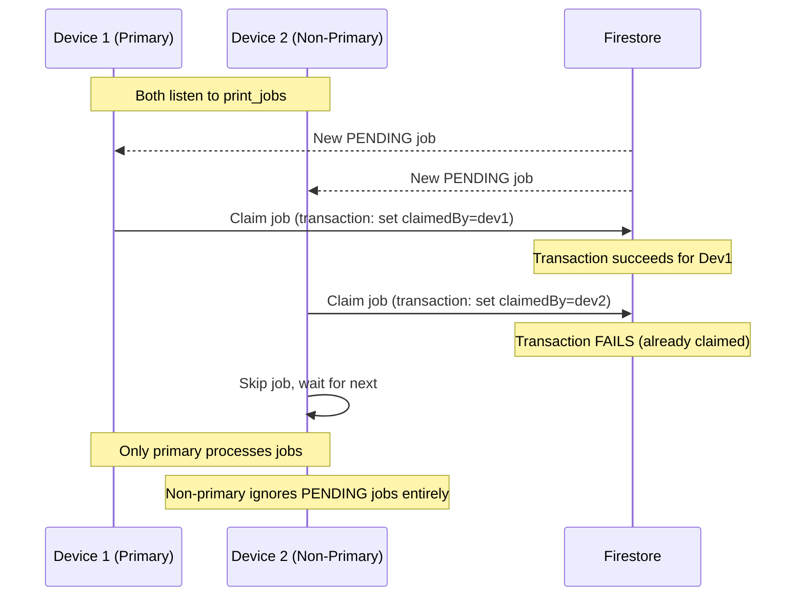
```mermaid
sequenceDiagram
    participant Dev1 as Device 1 (Primary)
    participant Dev2 as Device 2 (Non-Primary)
    participant FS as Firestore

    Note over Dev1,Dev2: Both listen to print_jobs
    FS-->>Dev1: New PENDING job
    FS-->>Dev2: New PENDING job
    
    Dev1->>FS: Claim job (transaction: set claimedBy=dev1)
    Note over FS: Transaction succeeds for Dev1
    
    Dev2->>FS: Claim job (transaction: set claimedBy=dev2)
    Note over FS: Transaction FAILS (already claimed)
    Dev2->>Dev2: Skip job, wait for next

    Note over Dev1,Dev2: Only primary processes jobs
    Note over Dev2: Non-primary ignores PENDING jobs entirely
```

### Printer Reconnection Strategy

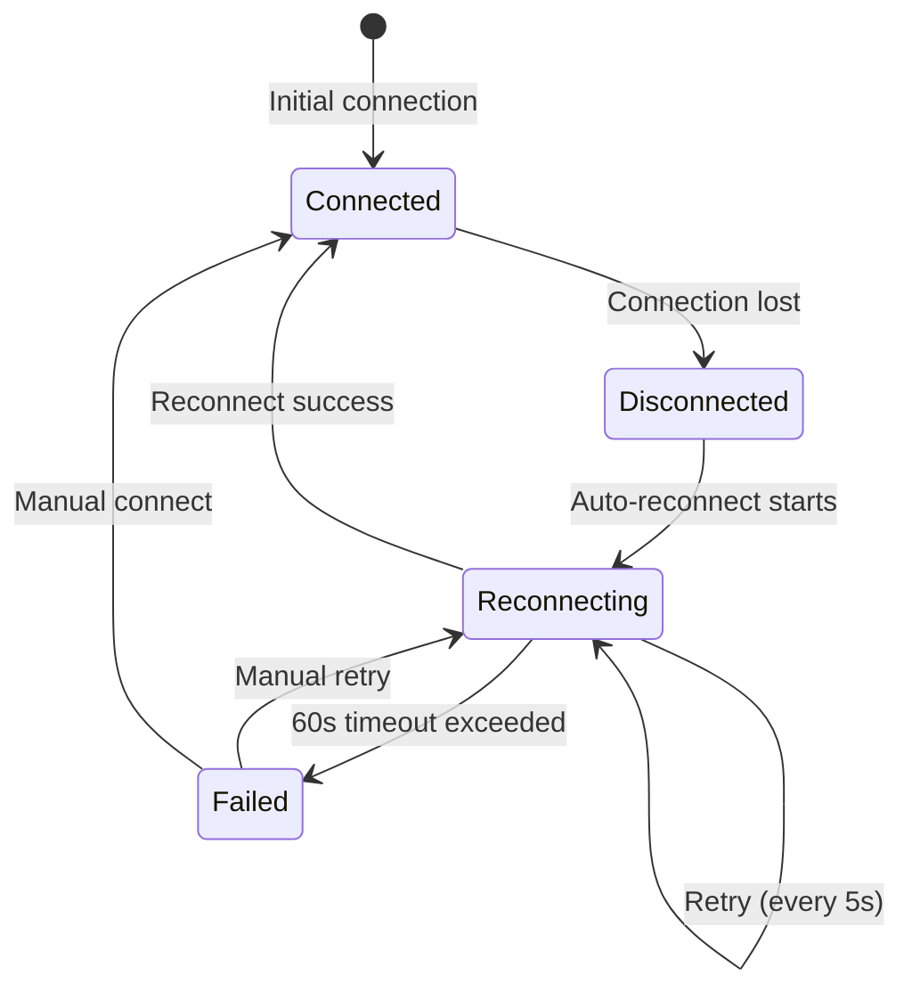
```mermaid
stateDiagram-v2
    [*] --> Connected : Initial connection
    Connected --> Disconnected : Connection lost
    Disconnected --> Reconnecting : Auto-reconnect starts
    Reconnecting --> Connected : Reconnect success
    Reconnecting --> Reconnecting : Retry (every 5s)
    Reconnecting --> Failed : 60s timeout exceeded
    Failed --> Reconnecting : Manual retry
    Failed --> Connected : Manual connect
```

**Reconnection Parameters:**
- Interval: 5 seconds between attempts
- Timeout: 60 seconds total
- After timeout: Stop auto-reconnect, set status "disconnected", show notification
- Manual retry: Available from Settings screen

### Duplicate Prevention

1. **Firestore Transactions** — Only one device can claim a job. The transaction reads current status, checks it's still PENDING, then atomically sets PROCESSING + claimedBy.
2. **Device ID Check** — Before printing, agent verifies `claimedBy` matches its own device ID.
3. **Idempotent Status Updates** — If agent crashes after printing but before updating status, it checks Room DB on restart for jobs marked "printed locally" and syncs their COMPLETED status.
4. **Job Expiry** — Jobs in PROCESSING for >5 minutes without completion are released back to PENDING by a Cloud Function (future) or client-side check.

### Offline Queueing

**Room Database Tables:**
- `local_print_queue` — Jobs waiting for printer or internet
- `local_orders` — Orders created offline waiting for sync

**Queue Limits:**
- Print jobs: 500 max (older jobs dropped with warning)
- Orders: 500 max

**Drain Strategy:**
- On printer reconnect: Process all queued print jobs in FIFO order
- On internet reconnect: Sync all orders via WorkManager, then sync print statuses
- Failed drain: Retry each job up to 3 times, skip on failure, continue with next

### Retry Policies

| Operation | Max Retries | Backoff | Base Interval |
|-----------|-------------|---------|---------------|
| Print to Bluetooth | 3 | Exponential | 2s (2s, 4s, 8s) |
| Claim job (transaction) | 3 | Fixed | 2s |
| Sync order to Firestore | 5 | Exponential | 5s |
| Printer reconnection | 12 | Fixed | 5s (total 60s) |

---

## Migration Plan

### Phase Overview

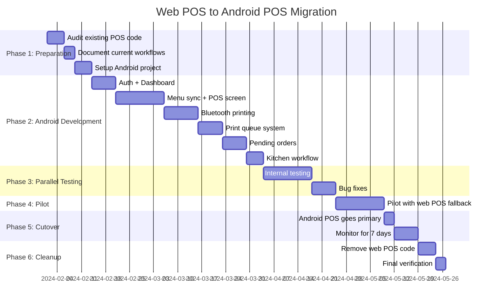
```mermaid
gantt
    title Web POS to Android POS Migration
    dateFormat  YYYY-MM-DD
    section Phase 1: Preparation
    Audit existing POS code        :p1a, 2024-02-01, 5d
    Document current workflows     :p1b, after p1a, 3d
    Setup Android project          :p1c, after p1b, 5d
    
    section Phase 2: Android Development
    Auth + Dashboard               :p2a, after p1c, 7d
    Menu sync + POS screen         :p2b, after p2a, 14d
    Bluetooth printing             :p2c, after p2b, 10d
    Print queue system             :p2d, after p2c, 7d
    Pending orders                 :p2e, after p2d, 7d
    Kitchen workflow               :p2f, after p2e, 5d
    
    section Phase 3: Parallel Testing
    Internal testing               :p3a, after p2f, 14d
    Bug fixes                      :p3b, after p3a, 7d
    
    section Phase 4: Pilot
    Pilot with web POS fallback    :p4a, after p3b, 14d
    
    section Phase 5: Cutover
    Android POS goes primary       :p5a, after p4a, 3d
    Monitor for 7 days             :p5b, after p5a, 7d
    
    section Phase 6: Cleanup
    Remove web POS code            :p6a, after p5b, 5d
    Final verification             :p6b, after p6a, 3d
```

### Phase 1: Preparation

**Goals:**
- Audit all existing web POS code and identify dependencies
- Document all current POS workflows (order creation, billing, printing)
- Set up Android project skeleton with module structure

**What stays in Next.js:**
- `/admin/menu-builder` — Menu Builder
- `/admin/inventory` — Inventory Management
- `/admin/orders` — Delivery order tracking
- `/admin/sales` — Sales/Reports dashboard
- `/admin/riders` — Rider management
- `/admin/delivery` — Delivery settings
- `/menu` — Customer-facing menu
- `/checkout` — Customer checkout
- `/login` — Customer auth
- All `/api/*` routes (auth, inventory, webhooks)

**What moves to Android:**
- POS order creation (currently `/pos`)
- Bill generation (currently `/bills`, `/bill/[billNo]`)
- KOT generation and printing
- Cashier authentication (currently `/pos/login`)
- Real-time open orders management

**What gets deleted (Phase 6):**
- `/pos` directory and all child routes
- `/pos/login` page
- `/admin/pos` page (staff management moves to web admin or stays as-is)
- `/bill/[billNo]` page
- `/bills` page
- POS-specific components
- POS-specific Firestore functions (if unused by retained features)

**What gets retained for both:**
- `lib/firestore.ts` — Shared bill creation functions (used by reports)
- `lib/menu-builder.ts` — Used by Web Menu Builder
- `lib/orders.ts` — Used by customer ordering
- Firestore collections: `menus`, `orders`, `bills`, `counters`

### Phase 2: Android POS Development

**Sub-phases:**
1. Authentication + Dashboard (7 days)
2. Menu Synchronization + POS Screen (14 days)
3. Bluetooth Printer Integration (10 days)
4. Print Queue + Print Agent Service (7 days)
5. Pending Orders Pipeline (7 days)
6. Kitchen Workflow (5 days)

### Phase 3: Parallel Testing

**Strategy:**
- Run both web POS and Android POS simultaneously
- All orders created on Android are visible in web admin
- All bills created on Android use same counter sequence
- No duplicate order numbers (atomic counters in Firestore)

**Testing Checklist:**
- [ ] Create walk-in order on Android, verify in web admin
- [ ] Create takeaway order, verify KOT prints
- [ ] Accept WhatsApp pending order, verify KOT auto-prints
- [ ] Generate bill, verify bill number sequence
- [ ] Reprint from web dashboard, verify Android prints
- [ ] Disconnect printer mid-print, verify retry + queue
- [ ] Disconnect internet, create orders, verify sync on reconnect
- [ ] Multiple devices: verify only primary prints
- [ ] Verify menu changes propagate within 5 seconds
- [ ] Stress test: 20 orders in 5 minutes

### Phase 4: Pilot Rollout

**Strategy:**
- Deploy Android POS to one counter
- Web POS remains available as fallback
- Monitor for 14 days of real operation
- Track: order accuracy, print reliability, sync latency

**Rollback Plan:**
- If critical issue: Cashier switches back to web POS immediately
- No data loss — both systems share same Firestore collections
- Android orders and web orders are interchangeable

### Phase 5: Production Cutover

**Criteria to proceed:**
- 14 days of pilot with <1% print failure rate
- Zero data loss incidents
- Cashier satisfaction confirmed
- All order types tested in production

**Cutover Steps:**
1. Announce Android POS as primary (no web POS for new orders)
2. Monitor for 7 days
3. Web POS routes redirect to `/admin` with notice

### Phase 6: Web POS Removal

**Code Removal:**
```
DELETE: app/pos/ (entire directory)
DELETE: app/pos/login/ (entire directory)  
DELETE: app/bill/ (entire directory)
DELETE: app/bills/ (entire directory)
MODIFY: app/admin/pos/page.tsx → Redirect to /admin
MODIFY: lib/firestore.ts → Remove POS-only functions (if unused)
MODIFY: components/ → Remove POS-specific components
```

**Redirect Implementation:**
- All removed routes → HTTP 302 to `/admin`
- Show toast: "POS has moved to the Android app"

**Validation Checklist:**
- [ ] `npm run build` succeeds without errors
- [ ] All retained routes load correctly
- [ ] Menu Builder functions correctly
- [ ] Inventory management works
- [ ] Customer ordering flows work
- [ ] Reports show data from all channels
- [ ] No broken imports or dead code references

### Risks & Mitigation

| Risk | Impact | Mitigation |
|------|--------|-----------|
| Bluetooth printer unreliable | Orders not printed | Local queue + retry + offline mode |
| Firestore outage | All systems disconnected | Room DB offline cache, local operation |
| Android app crash | No POS available | Web POS as fallback during pilot, crash reporting |
| Menu sync delay | Wrong prices charged | 5-second SLA, local cache serves last known |
| Counter collision | Duplicate bill numbers | Firestore transactions guarantee atomicity |
| Device theft | Unauthorized access | Remote wipe capability, auth token invalidation |

---

## Implementation Roadmap

### Milestone 1: Architecture Setup (Week 1)

**Goals:** Project skeleton, CI/CD, module structure
**Deliverables:**
- Android project with Gradle multi-module setup
- Hilt DI configuration
- Navigation graph skeleton
- CI pipeline (build + lint)
- Firebase project configuration

**Dependencies:** None
**Complexity:** Low
**Testing:** Build compiles, Hilt graph resolves
**Success Criteria:** Clean build, all modules compile

### Milestone 2: Firebase Setup (Week 1–2)

**Goals:** Firestore collections, security rules, indexes
**Deliverables:**
- All Firestore collections created with sample data
- Security rules deployed
- Composite indexes deployed
- Firebase Auth configured for Android

**Dependencies:** Milestone 1
**Complexity:** Low–Medium
**Testing:** Security rules unit tests, index creation verified
**Success Criteria:** Read/write operations succeed with correct auth

### Milestone 3: Android Foundation (Week 2–3)

**Goals:** Auth flow, Dashboard, navigation
**Deliverables:**
- Login screen with Firebase Auth
- Dashboard with navigation cards
- Role validation
- Session management
- Connectivity monitoring

**Dependencies:** Milestone 2
**Complexity:** Medium
**Testing:** Login flow, role rejection, session persistence
**Success Criteria:** Cashier can log in and see Dashboard

### Milestone 4: Menu Synchronization (Week 3–4)

**Goals:** Real-time menu sync, Room cache, offline support
**Deliverables:**
- Room Database schema for menu cache
- Firestore → Room sync via onSnapshot
- Offline menu serving from Room
- Sync recovery on reconnect

**Dependencies:** Milestone 3
**Complexity:** Medium
**Testing:** Sync latency <5s, offline serves cached, reconnect syncs
**Success Criteria:** Menu changes appear on Android within 5 seconds

### Milestone 5: POS Screen (Week 4–6)

**Goals:** Full cashier order creation workflow
**Deliverables:**
- Three-panel landscape layout
- Category navigation
- Menu item grid
- Cart management
- Modifier selection dialog
- Order type selection
- Order confirmation + bill generation
- Favorites section

**Dependencies:** Milestone 4
**Complexity:** High
**Testing:** Order creation flow, modifier selection, cart operations
**Success Criteria:** Cashier can create complete order with modifiers

### Milestone 6: Pending Orders (Week 6–7)

**Goals:** Multi-channel order acceptance
**Deliverables:**
- Pending orders list with real-time updates
- Accept flow (convert to POS order + auto-KOT)
- Reject flow with reason
- Channel filtering
- Status indicators

**Dependencies:** Milestone 5
**Complexity:** Medium
**Testing:** Accept/reject flows, real-time updates, channel filtering
**Success Criteria:** WhatsApp orders appear and can be accepted within 3 seconds

### Milestone 7: Bluetooth Printing (Week 7–8)

**Goals:** Printer discovery, pairing, printing
**Deliverables:**
- Bluetooth scanner module
- Printer pairing workflow
- ESC/POS command builder
- Test print functionality
- Auto-reconnection
- Printer status monitoring

**Dependencies:** Milestone 3
**Complexity:** High
**Testing:** Pair, print, disconnect/reconnect, test print
**Success Criteria:** Print KOT and bill reliably on thermal printer

### Milestone 8: Print Queue (Week 8–9)

**Goals:** Firestore-backed print queue with agent
**Deliverables:**
- Print Agent Foreground Service
- Firestore listener for PENDING jobs
- Job claiming via transaction
- Retry with exponential backoff
- Local queue (Room) for offline
- Duplicate prevention
- Status updates

**Dependencies:** Milestone 7
**Complexity:** High
**Testing:** Job claim atomicity, retry on failure, offline queue, drain on reconnect
**Success Criteria:** Zero lost print jobs across all scenarios

### Milestone 9: Kitchen Workflow (Week 9–10)

**Goals:** Kitchen display and order state progression
**Deliverables:**
- Kitchen screen with FIFO queue
- State transitions (PREPARING → READY → COMPLETED)
- Elapsed time display
- Overdue indicator (30 min)
- Audio alert on READY
- Cashier notification on READY

**Dependencies:** Milestone 6
**Complexity:** Medium
**Testing:** State transitions, timer accuracy, alert triggering
**Success Criteria:** Kitchen staff can mark orders ready, cashier sees alert

### Milestone 10: Reports (Week 10)

**Goals:** Daily sales summary on Android
**Deliverables:**
- Daily summary card (total orders, revenue, average)
- Channel breakdown
- Bill list for selected date
- Date picker

**Dependencies:** Milestone 5
**Complexity:** Low
**Testing:** Report accuracy matches Firestore data
**Success Criteria:** Daily totals match actual orders

### Milestone 11: Migration (Week 11–14)

**Goals:** Pilot, cutover, web POS removal
**Deliverables:**
- Parallel testing completed
- 14-day pilot with monitoring
- Production cutover
- Web POS code removal
- Redirect implementation

**Dependencies:** All previous milestones
**Complexity:** Medium (risk management)
**Testing:** Full regression of retained web features
**Success Criteria:** Zero downtime, all orders processed correctly

### Milestone 12: Production Launch (Week 14)

**Goals:** Stable production operation
**Deliverables:**
- Monitoring dashboards
- Crash reporting (Firebase Crashlytics)
- Performance monitoring
- Documentation complete
- Onboarding guide

**Dependencies:** Milestone 11
**Complexity:** Low
**Testing:** Production smoke tests, load testing
**Success Criteria:** 99.5% uptime over first month

---


## Correctness Properties

*A property is a characteristic or behavior that should hold true across all valid executions of a system — essentially, a formal statement about what the system should do. Properties serve as the bridge between human-readable specifications and machine-verifiable correctness guarantees.*

### Property 1: Offline Menu Cache Round-Trip

*For any* valid menu tree cached in Room Database, when the device is offline, querying the menu should return the exact same menu tree that was last cached from Firestore — no missing nodes, no altered prices, no changed availability status.

**Validates: Requirements 1.5**

### Property 2: Order State Machine Validity

*For any* order in any state and any attempted state transition, the transition succeeds if and only if it follows the valid sequence (PENDING → ACCEPTED → PREPARING → READY → COMPLETED, or any state → CANCELLED, or PENDING → REJECTED), regardless of order channel. All other transitions are rejected and the order retains its current state.

**Validates: Requirements 4.4, 11.1, 11.2, 11.5**

### Property 3: Sequential Order Number Generation

*For any* sequence of N order number generation requests, all generated numbers are unique, strictly sequential, and greater than 1000.

**Validates: Requirements 3.2**

### Property 4: WhatsApp Message Completeness

*For any* order with items, the formatted WhatsApp message must contain the order number, every item name, every item quantity, every item price, and the correct order total.

**Validates: Requirements 3.3**

### Property 5: Pending Order Data Completeness

*For any* order submitted from any channel (WhatsApp, Website, QR, third-party), the stored pending order document contains the source channel identifier, a timestamp, customer details, complete item list with quantities, and order type.

**Validates: Requirements 4.1**

### Property 6: Pending Orders Sort Order

*For any* list of pending orders displayed to the cashier, the orders are sorted by creation timestamp ascending (oldest first).

**Validates: Requirements 4.2, 4.3**

### Property 7: Pending-to-POS Conversion Preserves Items

*For any* valid pending order that is accepted, the resulting POS order contains exactly the same items with the same quantities and prices as the original pending order — no items lost, duplicated, or altered.

**Validates: Requirements 4.5**

### Property 8: Rejection Reason Validation

*For any* string, rejecting a pending order succeeds if and only if the rejection reason length is between 1 and 200 characters inclusive. Empty strings and strings exceeding 200 characters are rejected.

**Validates: Requirements 4.7**

### Property 9: Cart Arithmetic

*For any* menu item added to the cart, the initial quantity is 1. For any cart item with quantity N, incrementing produces N+1 and decrementing produces N-1 (minimum 0, which removes the item). The cart subtotal always equals the sum of all item totals.

**Validates: Requirements 5.5**

### Property 10: Order Confirmation Produces Bill and Print Job

*For any* cart containing at least one item with a selected order type, confirming the order produces exactly one bill document and exactly one KOT print job document, both referencing the same order number.

**Validates: Requirements 5.6**

### Property 11: Print Job Creation Completeness

*For any* print action (KOT, Customer Bill, or Reprint), the created print job document contains all required fields: id, restaurantId, jobType, printerType, status=PENDING, payload with type-specific content, and createdAt. KOT payloads contain order number, time, items with quantities, and notes. Bill payloads contain restaurant header, itemized list, tax breakdown, total, and payment method. Reprint payloads contain the full original payload plus a REPRINT header and original job ID reference.

**Validates: Requirements 7.1, 7.2, 7.4, 7.5, 7.6**

### Property 12: Print Job State Machine

*For any* print job, the status transitions follow exactly: PENDING → PROCESSING → COMPLETED, or PENDING → PROCESSING → FAILED, or FAILED → PENDING (manual retry). No other transitions are valid.

**Validates: Requirements 7.10**

### Property 13: Retry with Exponential Backoff

*For any* failing operation (print, claim, or sync), the system retries up to the configured maximum (3 for print/claim, 5 for sync) with exponential backoff from the base interval. After exhausting all retries, the operation is marked as failed. The retry count never exceeds the maximum.

**Validates: Requirements 7.7, 8.4, 8.7, 1.8**

### Property 14: Duplicate Print Prevention

*For any* print job in PENDING status with multiple agents attempting to claim it concurrently, exactly one agent successfully claims the job via atomic transaction. All other claim attempts fail, and the job is processed exactly once.

**Validates: Requirements 7.8**

### Property 15: Primary Printer Uniqueness Invariant

*For any* set of registered devices, at most one device has `isPrimaryPrinter: true` at any given time. If a device attempts to designate itself as primary while another device already holds the designation, the attempt is rejected.

**Validates: Requirements 10.5, 10.7**

### Property 16: Device Offline Detection

*For any* device, the status evaluation returns OFFLINE if and only if the device's lastHeartbeat timestamp is older than 90 seconds from the current time.

**Validates: Requirements 10.4**

### Property 17: Kitchen Queue FIFO Order

*For any* set of orders in PREPARING state, the kitchen display sorts them by their `preparingAt` timestamp in ascending order (oldest first), with orders exceeding 30 minutes marked with an overdue indicator.

**Validates: Requirements 11.3, 11.6**

### Property 18: Offline Queue Capacity and Ordering

*For any* sequence of orders or print jobs created while offline, all are stored locally up to a maximum of 500. When connectivity is restored, items are processed in strict chronological order. No items within the capacity limit are lost.

**Validates: Requirements 12.1, 12.2, 12.3, 12.4, 12.5**

### Property 19: Report Aggregation Correctness

*For any* set of completed orders across multiple channels, the aggregate report totals equal the mathematical sum across all individual channel totals. Order count = len(orders), revenue = sum(grandTotal), average = revenue/count, and peak hour = the 1-hour slot with the highest order count. Each order is attributed to exactly one channel.

**Validates: Requirements 13.1, 13.3, 13.4**

### Property 20: Daily Report Date Boundary

*For any* order with a creation timestamp, the order is assigned to exactly one daily bucket defined as 00:00:00–23:59:59 in the restaurant's configured timezone. Orders near midnight boundaries are never double-counted or missed.

**Validates: Requirements 13.2**

### Property 21: Security Rules Enforce Role-Based Access

*For any* combination of user role (customer, cashier, manager) and collection operation (read, write), access is granted if and only if the role has permission per the defined matrix. Unauthorized attempts return a permission-denied error.

**Validates: Requirements 14.4, 14.5**

---

## Error Handling

### Error Categories and Responses

| Category | Trigger | User-Facing Response | System Action |
|----------|---------|---------------------|---------------|
| Network Error | Firestore unreachable | "You're offline. Orders are saved locally." | Switch to Room DB, queue for sync |
| Print Error | Bluetooth send fails | "Print failed. Retrying..." | Retry 3x with backoff, then show FAILED |
| Auth Error | Invalid credentials | "Invalid email or password" | Clear password field, retain email |
| Auth Error | Account pending | "Account pending admin approval" | Sign out, show message |
| Validation Error | Empty cart confirm | Button stays disabled | No action, UI prevents invalid state |
| Validation Error | No order type | Button stays disabled | No action, UI prevents invalid state |
| State Error | Invalid transition | "Cannot perform this action" | Reject transition, log warning |
| Sync Error | Order sync failure | "Sync failed. Retrying..." | WorkManager retry with backoff |
| Hardware Error | Printer not found | "No printers found. Check printer power." | Allow retry scan |
| Hardware Error | Pairing failed | "Pairing failed. Try again." | Allow retry pairing |
| Concurrency Error | Job claim conflict | Silent (internal) | Skip job, agent waits for next |
| Capacity Error | Offline queue full (500) | "Storage full. Clear old data." | Reject new items, alert user |

### Error Recovery Strategies

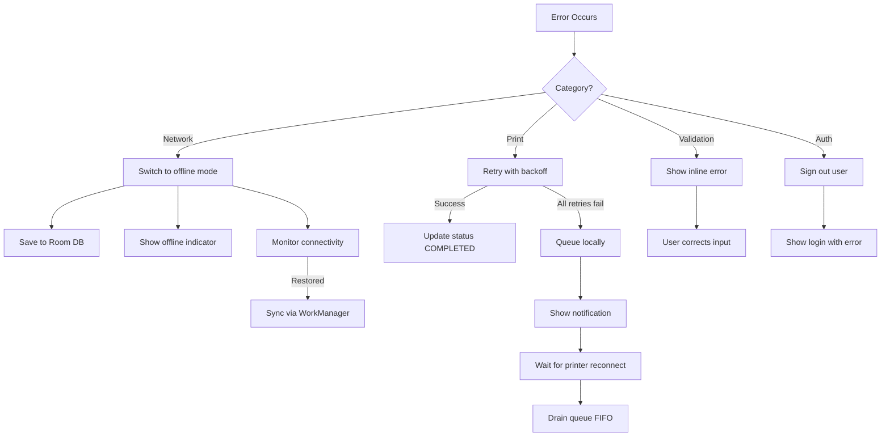
```mermaid
flowchart TD
    E[Error Occurs] --> C{Category?}
    C -->|Network| N[Switch to offline mode]
    N --> N1[Save to Room DB]
    N --> N2[Show offline indicator]
    N --> N3[Monitor connectivity]
    N3 -->|Restored| N4[Sync via WorkManager]
    
    C -->|Print| P[Retry with backoff]
    P -->|Success| P1[Update status COMPLETED]
    P -->|All retries fail| P2[Queue locally]
    P2 --> P3[Show notification]
    P3 --> P4[Wait for printer reconnect]
    P4 --> P5[Drain queue FIFO]
    
    C -->|Validation| V[Show inline error]
    V --> V1[User corrects input]
    
    C -->|Auth| A[Sign out user]
    A --> A1[Show login with error]
```

### Graceful Degradation

| System State | Available Features | Degraded Features |
|-------------|-------------------|-------------------|
| Fully Online | All features | None |
| Internet Offline | Create orders, print (local queue), kitchen view | Pending orders (cached only), reports, remote print |
| Printer Offline | Create orders, pending orders, kitchen | Printing (queued for later) |
| Both Offline | Create orders (local), view cached menu | All remote features, printing |

---

## Testing Strategy

### Dual Testing Approach

This ecosystem requires both property-based tests and example-based tests for comprehensive coverage.

**Property-Based Testing (PBT):**
- Library: **Kotest** (Kotlin) with property testing module
- Configuration: Minimum 100 iterations per property
- Focus: State machines, data transformations, arithmetic, validation logic, invariants
- Tag format: `Feature: dajaj-ecosystem, Property {N}: {description}`

**Example-Based Unit Tests:**
- Framework: **JUnit 5** + **MockK** (Kotlin)
- Focus: Specific scenarios, error handling, edge cases, integration boundaries
- Coverage: UI interactions, Firestore operations, Bluetooth communication

**Integration Tests:**
- Framework: **Espresso** (Android UI) + **Firebase Emulator Suite**
- Focus: End-to-end flows, Firestore security rules, real-time sync
- Environment: Firebase Emulators for local development

### Property-Based Tests (Kotest)

Each correctness property maps to a single property-based test:

```kotlin
// Feature: dajaj-ecosystem, Property 2: Order State Machine Validity
class OrderStateMachinePropertyTest : FunSpec({
    test("valid transitions succeed, invalid transitions are rejected") {
        checkAll(100, Arb.enum<OrderStatus>(), Arb.enum<OrderStatus>()) { current, target ->
            val result = OrderStateMachine.transition(current, target)
            if (isValidTransition(current, target)) {
                result.shouldBeSuccess()
            } else {
                result.shouldBeFailure()
            }
        }
    }
})
```

| Property | Test Class | Key Generators |
|----------|-----------|----------------|
| P1 | `MenuCacheRoundTripTest` | Random MenuNode trees |
| P2 | `OrderStateMachineTest` | Random (state, transition) pairs |
| P3 | `OrderNumberSequenceTest` | Random N concurrent requests |
| P4 | `WhatsAppMessageTest` | Random Order objects |
| P5 | `PendingOrderCompletenessTest` | Random orders from random channels |
| P6 | `PendingOrderSortTest` | Random timestamp lists |
| P7 | `OrderConversionTest` | Random PendingOrder objects |
| P8 | `RejectionReasonTest` | Random strings (Arb.string) |
| P9 | `CartArithmeticTest` | Random items and quantities |
| P10 | `OrderConfirmationTest` | Random valid carts |
| P11 | `PrintJobCreationTest` | Random print actions per type |
| P12 | `PrintJobStateMachineTest` | Random (status, transition) pairs |
| P13 | `RetryBackoffTest` | Random failure sequences |
| P14 | `DuplicatePreventionTest` | Concurrent claim simulations |
| P15 | `PrimaryPrinterInvariantTest` | Random device sets |
| P16 | `DeviceOfflineDetectionTest` | Random timestamps vs current time |
| P17 | `KitchenQueueOrderTest` | Random orders with timestamps |
| P18 | `OfflineQueueCapacityTest` | Random job sequences up to 600 |
| P19 | `ReportAggregationTest` | Random order sets across channels |
| P20 | `DateBoundaryTest` | Random timestamps near midnight |
| P21 | `SecurityRulesTest` | Random (role, collection, operation) triples |

### Unit Tests (Example-Based)

| Area | Test Examples |
|------|--------------|
| Auth | Login success, login failure (wrong password), pending account, rejected account |
| Cart | Add item, remove item, clear cart, modifier selection |
| Order | Confirm walk-in, confirm takeaway, empty cart rejection |
| Print | Test print success, test print timeout, print failure notification |
| Pending | Accept success, reject with reason, accept with unavailable item |
| Kitchen | Mark ready, overdue detection, FIFO ordering |
| Offline | Save order offline, sync on reconnect, queue capacity |
| Reports | Daily summary calculation, empty period handling |

### Integration Tests

| Flow | Test Scope |
|------|-----------|
| End-to-end order | Create order → KOT prints → Kitchen marks ready → Complete |
| Remote reprint | Web creates print job → Agent detects → Prints → Status updates |
| WhatsApp flow | Customer submits → Pending appears → Cashier accepts → KOT prints |
| Offline → Online | Create orders offline → Reconnect → Verify all synced to Firestore |
| Multi-device | Two devices → Print job created → Only primary claims |
| Menu sync | Web updates menu → Android reflects within 5s |

### Test Environment

- **Firebase Emulator Suite** for local Firestore, Auth
- **MockK** for Bluetooth adapter mocking
- **Robolectric** for Android framework mocking in unit tests
- **Espresso** for UI integration tests
- **Kotest** for property-based tests (minimum 100 iterations each)

---
