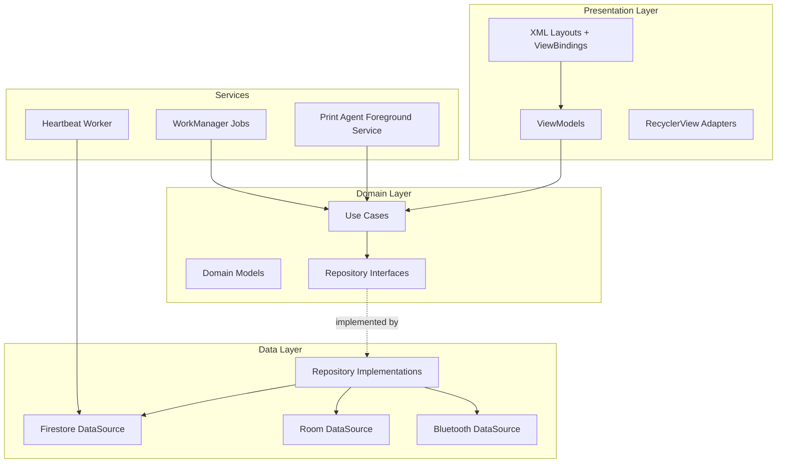
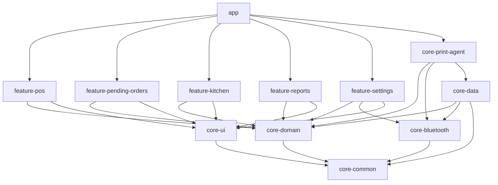
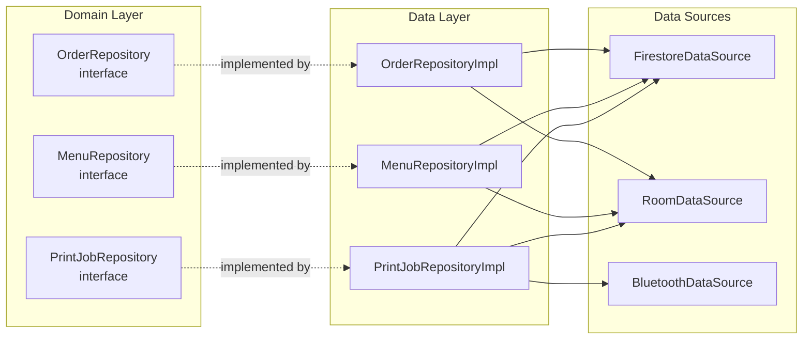
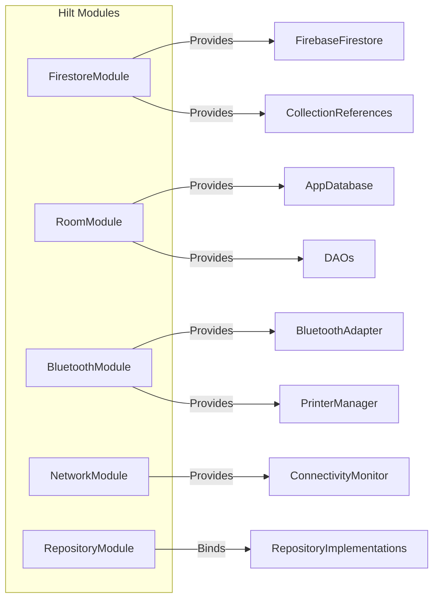
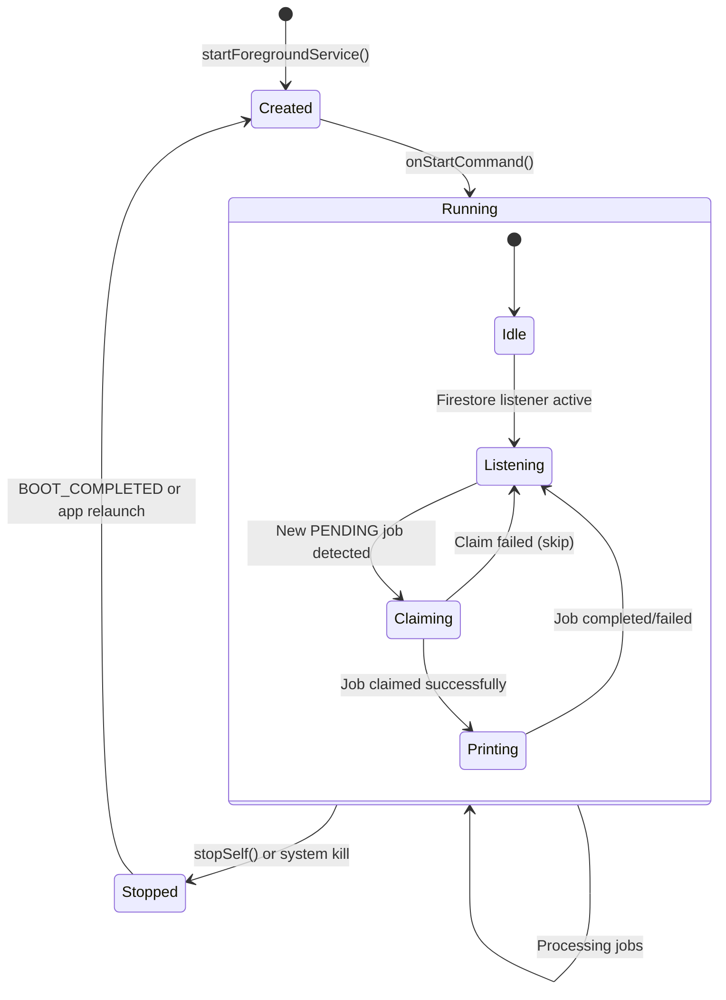
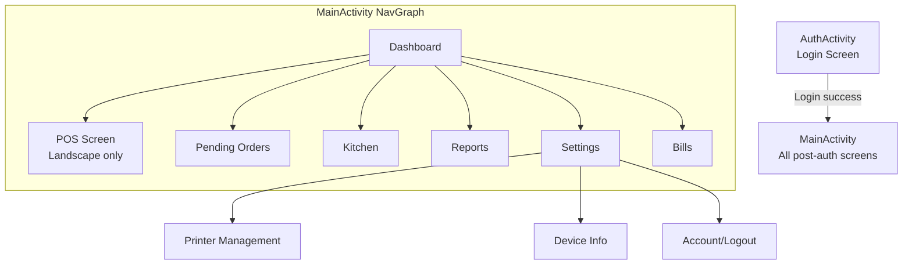

# Android Architecture

## Overview

The Dajaj Android POS follows **MVVM + Clean Architecture** with clear layer boundaries. The app uses Kotlin, XML layouts (not Jetpack Compose), Hilt for dependency injection, Room for local persistence, and Firebase Firestore for real-time data sync.

---

## Architecture Layers



### Layer Responsibilities

| Layer | Contains | Depends On | Rules |
|-------|----------|-----------|-------|
| **Presentation** | Activities, Fragments, ViewModels, Adapters, XML layouts | Domain | No Firestore/Room imports. Only observes domain models. |
| **Domain** | Use Cases, Domain Models, Repository Interfaces | Nothing | Pure Kotlin. No Android framework imports. No Firebase/Room. |
| **Data** | Repository Implementations, DataSources, Mappers, DTOs | Domain (interfaces) | Implements repository interfaces. Contains Firestore/Room logic. |
| **Services** | Foreground Services, WorkManager Workers | Domain | Access domain layer via Use Cases. |

### Dependency Rule

Dependencies flow inward: **Presentation → Domain ← Data**

The domain layer has zero dependencies on Android, Firebase, or Room. It defines interfaces that the data layer implements.

---

## Module Structure (12 Modules)

```
dajaj-android/
├── app/                          # Application module
├── feature-pos/                  # POS screen, cart, order creation
├── feature-pending-orders/       # Pending orders list and acceptance
├── feature-kitchen/              # Kitchen preparation queue
├── feature-reports/              # Sales reports display
├── feature-settings/             # Printer settings, device management
├── core-domain/                  # Use cases, domain models, repository interfaces
├── core-data/                    # Repository implementations, data sources
├── core-bluetooth/               # Bluetooth printer communication
├── core-print-agent/             # Foreground service, print queue processing
├── core-ui/                      # Shared UI components, themes, styles
└── core-common/                  # Utilities, extensions, constants
```

### Module Dependency Graph



### Module Descriptions

| Module | Responsibility |
|--------|---------------|
| `app` | Application class, Hilt setup, MainActivity, AuthActivity, Navigation graph, DI modules |
| `feature-pos` | POS 3-panel screen, cart management, order creation, modifier dialogs |
| `feature-pending-orders` | Pending orders list, accept/reject flows, channel filtering |
| `feature-kitchen` | Kitchen FIFO queue, elapsed timers, mark-ready workflow |
| `feature-reports` | Daily sales summary, channel breakdown |
| `feature-settings` | Printer management, device info, account/logout |
| `core-domain` | Use cases, domain models, repository interfaces, business rules |
| `core-data` | Repository implementations, Firestore/Room data sources, entity mappers |
| `core-bluetooth` | BluetoothSocket management, ESC/POS commands, printer discovery |
| `core-print-agent` | Print Agent Foreground Service, job claiming, queue processing |
| `core-ui` | Shared XML components, Material 3 theme, custom views, styles |
| `core-common` | Extension functions, constants, utility classes |

---

## Repository Pattern

Repositories abstract data sources behind domain-defined interfaces.



### Key Repositories

| Repository Interface | Data Sources | Purpose |
|---------------------|-------------|---------|
| `MenuRepository` | Firestore + Room | Sync menu, cache locally, serve offline |
| `OrderRepository` | Firestore + Room | Create/update orders, offline queue |
| `PendingOrderRepository` | Firestore | Listen for pending orders, accept/reject |
| `PrintJobRepository` | Firestore + Room | Create jobs, claim jobs, local queue |
| `DeviceRepository` | Firestore | Register device, heartbeat, primary status |
| `UserRepository` | Firestore + Firebase Auth | Auth, role validation, session |
| `BillRepository` | Firestore | Create bills, fetch by date |
| `PrinterRepository` | Room + Bluetooth | Paired printers, connection status |

### Data Flow Example: Menu Sync

```kotlin
// Domain layer — interface
interface MenuRepository {
    fun observeMenu(): Flow<List<MenuItem>>
    suspend fun refreshMenu()
    fun getCachedMenu(): List<MenuItem>
}

// Data layer — implementation
class MenuRepositoryImpl(
    private val firestoreDataSource: MenuFirestoreDataSource,
    private val roomDataSource: MenuRoomDataSource
) : MenuRepository {

    override fun observeMenu(): Flow<List<MenuItem>> {
        // Listen to Firestore, cache in Room, emit from Room
        return firestoreDataSource.observeMenuChanges()
            .onEach { items -> roomDataSource.cacheMenu(items) }
            .catch { emit(roomDataSource.getCachedMenu()) } // Fallback to cache
    }
}
```

---

## Use Cases

Use cases encapsulate single business operations. Each use case has one public method (`invoke` or `execute`).

### Key Use Cases

| Use Case | Module | Business Rule |
|----------|--------|---------------|
| `CreateOrderUseCase` | core-domain | Validate cart, generate order number, create order + print job |
| `AcceptPendingOrderUseCase` | core-domain | Convert pending → POS order, generate KOT, validate items |
| `RejectPendingOrderUseCase` | core-domain | Validate reason (1–200 chars), update status |
| `ClaimPrintJobUseCase` | core-domain | Transaction: verify PENDING, set PROCESSING + deviceId |
| `ProcessPrintJobUseCase` | core-domain | Send to printer, retry on failure, update status |
| `SyncOfflineOrdersUseCase` | core-domain | Upload Room orders to Firestore in chronological order |
| `RegisterDeviceUseCase` | core-domain | Register in device registry, set online, heartbeat |
| `GetKitchenQueueUseCase` | core-domain | Return PREPARING orders sorted FIFO |
| `MarkOrderReadyUseCase` | core-domain | Transition PREPARING → READY, trigger alert |
| `GenerateBillUseCase` | core-domain | Create bill document from completed order |

### Use Case Pattern

```kotlin
class AcceptPendingOrderUseCase @Inject constructor(
    private val pendingOrderRepository: PendingOrderRepository,
    private val orderRepository: OrderRepository,
    private val printJobRepository: PrintJobRepository
) {
    suspend operator fun invoke(pendingOrderId: String): Result<Order> {
        val pendingOrder = pendingOrderRepository.getById(pendingOrderId)
            ?: return Result.failure(NotFoundException("Order not found"))

        // Validate all items are still available
        // Convert to POS order
        // Create KOT print job
        // Update pending order status to ACCEPTED

        return Result.success(createdOrder)
    }
}
```

---

## Hilt Dependency Injection Configuration



### Module Definitions

```kotlin
// FirestoreModule — provides Firebase instances
@Module
@InstallIn(SingletonComponent::class)
object FirestoreModule {
    @Provides @Singleton
    fun provideFirestore(): FirebaseFirestore = Firebase.firestore

    @Provides @Singleton
    fun provideAuth(): FirebaseAuth = Firebase.auth
}

// RoomModule — provides database and DAOs
@Module
@InstallIn(SingletonComponent::class)
object RoomModule {
    @Provides @Singleton
    fun provideDatabase(@ApplicationContext context: Context): AppDatabase =
        Room.databaseBuilder(context, AppDatabase::class.java, "dajaj_pos.db").build()

    @Provides
    fun provideMenuDao(db: AppDatabase): MenuDao = db.menuDao()

    @Provides
    fun provideOrderDao(db: AppDatabase): OrderDao = db.orderDao()

    @Provides
    fun providePrintJobDao(db: AppDatabase): PrintJobDao = db.printJobDao()
}

// BluetoothModule — provides Bluetooth components
@Module
@InstallIn(SingletonComponent::class)
object BluetoothModule {
    @Provides @Singleton
    fun provideBluetoothAdapter(@ApplicationContext context: Context): BluetoothAdapter? =
        (context.getSystemService(Context.BLUETOOTH_SERVICE) as BluetoothManager).adapter

    @Provides @Singleton
    fun providePrinterManager(adapter: BluetoothAdapter?): PrinterManager =
        PrinterManager(adapter)
}

// RepositoryModule — binds interfaces to implementations
@Module
@InstallIn(SingletonComponent::class)
abstract class RepositoryModule {
    @Binds abstract fun bindMenuRepository(impl: MenuRepositoryImpl): MenuRepository
    @Binds abstract fun bindOrderRepository(impl: OrderRepositoryImpl): OrderRepository
    @Binds abstract fun bindPrintJobRepository(impl: PrintJobRepositoryImpl): PrintJobRepository
    @Binds abstract fun bindDeviceRepository(impl: DeviceRepositoryImpl): DeviceRepository
}
```

### Scope Summary

| Scope | Lifecycle | Used For |
|-------|-----------|----------|
| `@Singleton` | Application | Firestore, Room DB, BluetoothAdapter, Repositories |
| `@ActivityScoped` | Activity | Navigation, shared ViewModels |
| `@ViewModelScoped` | ViewModel | Feature-specific data holders |
| `@ServiceScoped` | Service | Print Agent dependencies |

---

## Room Database

### Database Class

```kotlin
@Database(
    entities = [
        MenuEntity::class,
        LocalOrderEntity::class,
        LocalPrintJobEntity::class,
        PairedPrinterEntity::class
    ],
    version = 1
)
abstract class AppDatabase : RoomDatabase() {
    abstract fun menuDao(): MenuDao
    abstract fun orderDao(): OrderDao
    abstract fun printJobDao(): PrintJobDao
    abstract fun printerDao(): PrinterDao
}
```

### Tables

| Table | Purpose | Key Fields |
|-------|---------|-----------|
| `menu_items` | Cached menu from Firestore | id, name, parentId, type, price, isAvailable, order |
| `local_orders` | Offline orders pending sync | id, orderData (JSON), status, createdAt |
| `local_print_jobs` | Print queue for offline/disconnected printer | id, jobType, payload (JSON), status, retryCount |
| `paired_printers` | Known printers and their roles | mac, name, isKotPrinter, isBillPrinter |

### Offline Strategy

- **Menu:** Room serves as read-through cache. Full menu cached on sync.
- **Orders:** Created in Room when offline, synced via WorkManager on connectivity.
- **Print Jobs:** Queued in Room when printer disconnected, drained on reconnect.
- **Limits:** 500 orders, 500 print jobs maximum in local storage.

---

## Foreground Service Lifecycle

### Print Agent Service



### Service Registration (AndroidManifest.xml)

```xml
<service
    android:name=".service.PrintAgentService"
    android:foregroundServiceType="connectedDevice"
    android:exported="false" />

<receiver android:name=".receiver.BootReceiver"
    android:exported="false">
    <intent-filter>
        <action android:name="android.intent.action.BOOT_COMPLETED" />
    </intent-filter>
</receiver>
```

### Notification Channel

```kotlin
val channel = NotificationChannel(
    "print_agent",
    "Print Agent",
    NotificationManager.IMPORTANCE_LOW
).apply {
    description = "Print Agent background service"
    setShowBadge(false)
}
```

---

## WorkManager Sync

### Workers

| Worker | Schedule | Purpose |
|--------|----------|---------|
| `HeartbeatWorker` | Periodic (30s) | Update device heartbeat in Firestore |
| `OrderSyncWorker` | OneTime (on connectivity) | Upload offline orders to Firestore |
| `PrintStatusSyncWorker` | OneTime (on connectivity) | Sync local print statuses to Firestore |
| `MenuRefreshWorker` | Periodic (1 hour) | Full menu refresh as safety net |

### Constraints

```kotlin
val syncConstraints = Constraints.Builder()
    .setRequiredNetworkType(NetworkType.CONNECTED)
    .build()

val orderSyncRequest = OneTimeWorkRequestBuilder<OrderSyncWorker>()
    .setConstraints(syncConstraints)
    .setBackoffCriteria(BackoffPolicy.EXPONENTIAL, 5, TimeUnit.SECONDS)
    .build()

WorkManager.getInstance(context).enqueueUniqueWork(
    "order_sync",
    ExistingWorkPolicy.KEEP,
    orderSyncRequest
)
```

---

## Navigation Architecture



### Activity Structure

| Activity | Orientation | Purpose |
|----------|------------|---------|
| `AuthActivity` | Portrait | Login flow |
| `MainActivity` | Portrait + Landscape | All post-auth screens |

### Navigation Component

- AndroidX Navigation Component with NavGraph
- Fragment-based navigation within MainActivity
- SafeArgs for type-safe argument passing
- DeepLinks for notification-triggered navigation

---

## Error Handling Strategy

| Layer | Strategy |
|-------|----------|
| Presentation | Show Snackbar/Dialog, retry buttons |
| Domain | Return `Result<T>` (success/failure) |
| Data | Catch exceptions, map to domain errors |
| Service | Log, retry, update notification |

### Domain Error Types

```kotlin
sealed class DomainError {
    object NetworkUnavailable : DomainError()
    object PrinterDisconnected : DomainError()
    object OrderNotFound : DomainError()
    object InvalidStateTransition : DomainError()
    object MenuItemUnavailable : DomainError()
    data class ValidationError(val message: String) : DomainError()
    data class FirestoreError(val cause: Throwable) : DomainError()
}
```
