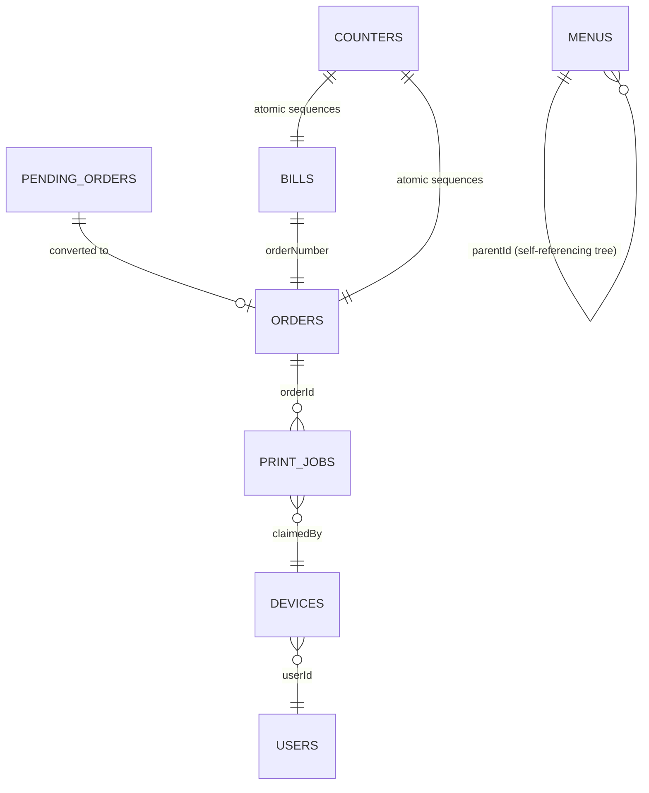
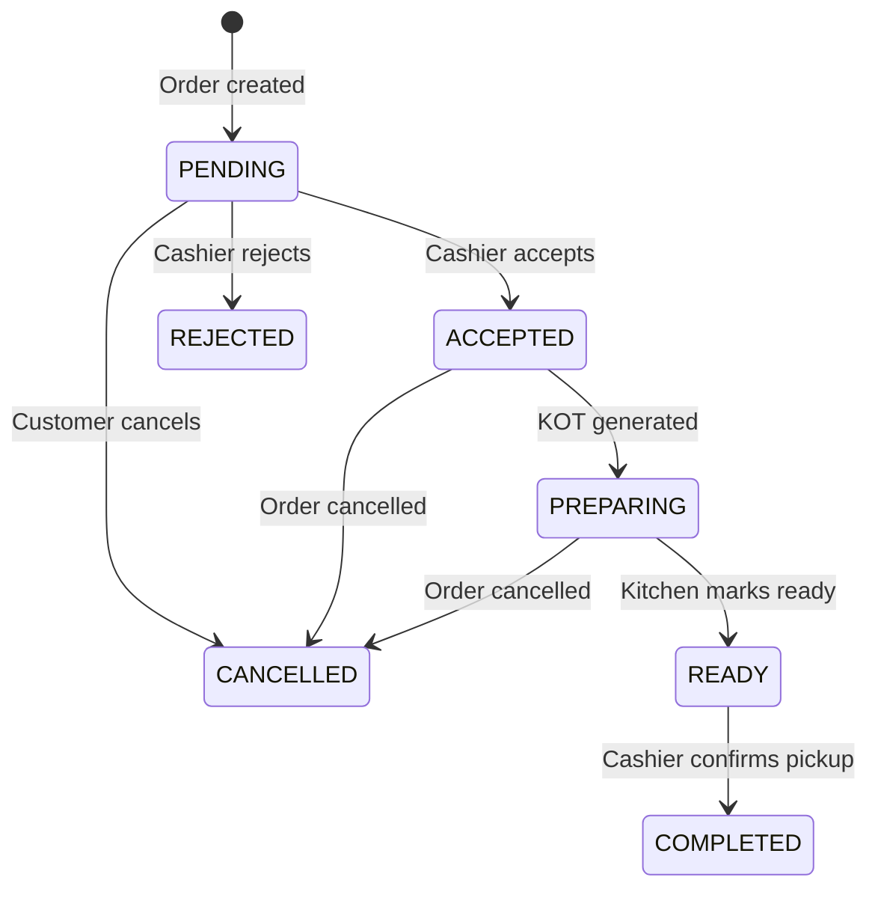
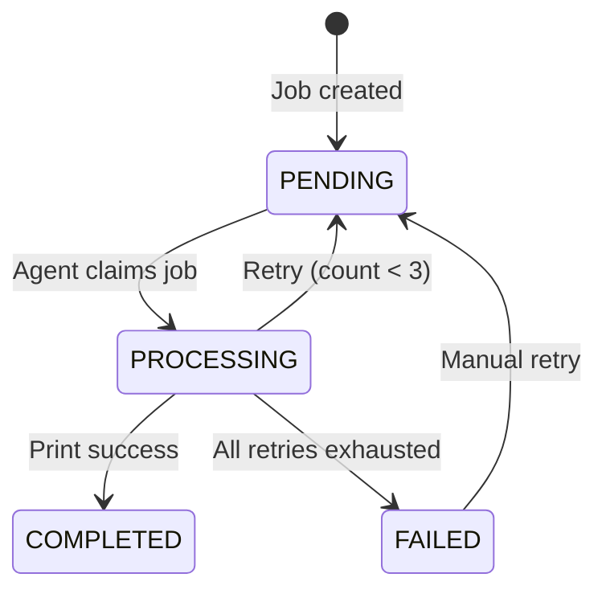

# Firestore Schema

## Overview

Firebase Firestore is the sole communication backbone for the Dajaj Ecosystem. All inter-client data exchange passes through Firestore collections. This document defines every collection, document structure, field types, relationships, security rules, and required indexes.

---

## Entity Relationship Diagram



---

## Collection: `menus`

**Purpose:** Single source of truth for all menu definitions. Hierarchical tree structure using `parentId` references.

**Tree depth:** category → variant → modifierGroup → modifier

### Document Structure

| Field | Type | Required | Description |
|-------|------|----------|-------------|
| `id` | string | Yes | Auto-generated Firestore document ID |
| `name` | string | Yes | Display name (1–100 characters) |
| `parentId` | string \| null | Yes | Reference to parent node, null for root categories |
| `type` | string | Yes | Enum: `category`, `variant`, `modifierGroup`, `modifier` |
| `price` | number | Yes | Item price (≥0, meaningful for variant/modifier) |
| `selectionType` | string | Yes | Enum: `single`, `multiple`, `""` |
| `minSelection` | number | Yes | Minimum selections (≥0, for modifierGroup) |
| `maxSelection` | number | Yes | Maximum selections (≥0, ≥ minSelection) |
| `description` | string | No | Item description (0–500 characters) |
| `imageUrl` | string | No | Image URL or empty string |
| `isAvailable` | boolean | Yes | Availability toggle (default: true) |
| `trackInventory` | boolean | Yes | Whether item tracks inventory |
| `inventoryMultiplier` | number \| null | No | Multiplier for inventory deduction (>0) |
| `inventoryTrackingMode` | string \| null | No | Enum: `aggregate`, `items`, null |
| `order` | number | Yes | Sibling sort order (≥0) |
| `createdAt` | timestamp | Yes | Server timestamp on creation |
| `updatedAt` | timestamp | Yes | Server timestamp on update |

### Example Document

```json
{
  "id": "abc123",
  "name": "Regular Alfaham",
  "parentId": "cat_alfaham",
  "type": "variant",
  "price": 120,
  "selectionType": "",
  "minSelection": 0,
  "maxSelection": 0,
  "description": "Classic alfaham preparation",
  "imageUrl": "https://storage.googleapis.com/dajaj/alfaham.jpg",
  "isAvailable": true,
  "trackInventory": true,
  "inventoryMultiplier": 1,
  "inventoryTrackingMode": null,
  "order": 0,
  "createdAt": "2024-01-15T10:30:00.000Z",
  "updatedAt": "2024-01-15T10:30:00.000Z"
}
```

### Relationships

- Self-referencing via `parentId` (tree hierarchy)
- Never hard-deleted in production (set `isAvailable: false`)

---

## Collection: `orders`

**Purpose:** All confirmed orders from all channels. Primary business data.

### Document Structure

| Field | Type | Required | Description |
|-------|------|----------|-------------|
| `id` | string | Yes | Sequential numeric from counter |
| `restaurantId` | string | Yes | Restaurant identifier |
| `orderNumber` | string | Yes | Format: DDMMYY#### (e.g., "1104260001") |
| `channel` | string | Yes | Enum: `walk_in`, `whatsapp`, `website`, `qr`, `swiggy`, `zomato` |
| `type` | string | Yes | Enum: `walk_in`, `takeaway`, `dine_in` |
| `status` | string | Yes | Enum: `pending`, `accepted`, `preparing`, `ready`, `completed`, `cancelled` |
| `customerId` | string | No | Customer user ID |
| `customerName` | string | No | Customer display name |
| `customerPhone` | string | No | Customer phone number |
| `items` | array | Yes | Array of order items (≥1 item) |
| `items[].id` | string | Yes | Item identifier |
| `items[].sku` | string | Yes | Item SKU |
| `items[].name` | string | Yes | Item display name |
| `items[].variantLabel` | string | No | Variant label |
| `items[].variantId` | string | No | Variant document ID |
| `items[].qty` | number | Yes | Quantity ordered |
| `items[].basePrice` | number | Yes | Base price per unit |
| `items[].modifiers` | array | No | Selected modifiers |
| `items[].modifiers[].id` | string | Yes | Modifier ID |
| `items[].modifiers[].name` | string | Yes | Modifier name |
| `items[].modifiers[].price` | number | Yes | Modifier price |
| `items[].modifiers[].groupName` | string | Yes | Modifier group |
| `items[].itemTotal` | number | Yes | Line total (basePrice * qty + modifiers) |
| `subtotal` | number | Yes | Sum of all item totals (>0) |
| `cgst` | number | Yes | CGST amount (≥0) |
| `sgst` | number | Yes | SGST amount (≥0) |
| `grandTotal` | number | Yes | subtotal + cgst + sgst |
| `paymentMode` | string | Yes | Enum: `cash`, `upi`, `card` |
| `cashCollected` | number | No | Cash received from customer |
| `cashierId` | string | No | Staff ID who processed the order |
| `rejectionReason` | string \| null | No | Reason for rejection (1–200 chars) |
| `createdAt` | timestamp | Yes | Server timestamp |
| `updatedAt` | timestamp | Yes | Server timestamp |
| `acceptedAt` | timestamp | No | When order was accepted |
| `preparingAt` | timestamp | No | When order entered kitchen |
| `readyAt` | timestamp | No | When order was marked ready |
| `completedAt` | timestamp | No | When order was completed |

### Order State Machine



### Valid State Transitions

| From | To | Trigger |
|------|-----|---------|
| PENDING | ACCEPTED | Cashier accepts pending order |
| PENDING | REJECTED | Cashier rejects with reason |
| PENDING | CANCELLED | Customer/system cancellation |
| ACCEPTED | PREPARING | KOT print job created |
| PREPARING | READY | Kitchen marks order ready |
| READY | COMPLETED | Cashier confirms customer pickup |
| Any active | CANCELLED | Cancellation event |

---

## Collection: `pending_orders`

**Purpose:** Incoming orders from external channels (WhatsApp, Website, QR, third-party) awaiting cashier acceptance.

### Document Structure

| Field | Type | Required | Description |
|-------|------|----------|-------------|
| `id` | string | Yes | Auto-generated document ID |
| `restaurantId` | string | Yes | Restaurant identifier |
| `orderNumber` | string | Yes | Sequential numeric order number (>1000) |
| `channel` | string | Yes | Enum: `whatsapp`, `website`, `qr`, `swiggy`, `zomato` |
| `status` | string | Yes | Enum: `pending`, `accepted`, `rejected` |
| `customerName` | string | Yes | Customer display name |
| `customerPhone` | string | Yes | Customer phone number |
| `items` | array | Yes | Array of order items |
| `items[].name` | string | Yes | Item display name |
| `items[].qty` | number | Yes | Quantity |
| `items[].price` | number | Yes | Unit price |
| `items[].total` | number | Yes | Line total |
| `total` | number | Yes | Order total |
| `notes` | string | No | Customer special instructions |
| `rejectionReason` | string \| null | No | Rejection reason (1–200 chars) |
| `createdAt` | timestamp | Yes | Server timestamp |
| `processedAt` | timestamp \| null | No | When accepted or rejected |

### Example Document

```json
{
  "id": "po_abc123",
  "restaurantId": "dajaj_main",
  "orderNumber": "1045",
  "channel": "whatsapp",
  "status": "pending",
  "customerName": "Ahmed Khan",
  "customerPhone": "+919876543210",
  "items": [
    { "name": "Regular Alfaham Quarter", "qty": 2, "price": 120, "total": 240 },
    { "name": "Peri Peri Shawarma Roll", "qty": 1, "price": 60, "total": 60 }
  ],
  "total": 300,
  "notes": "Extra spicy please",
  "rejectionReason": null,
  "createdAt": "2024-01-15T14:25:00.000Z",
  "processedAt": null
}
```

---

## Collection: `print_jobs`

**Purpose:** Queue for all print operations. All printing flows through this collection — never directly from UI.

### Document Structure

| Field | Type | Required | Description |
|-------|------|----------|-------------|
| `id` | string | Yes | Auto-generated document ID |
| `restaurantId` | string | Yes | Restaurant identifier |
| `jobType` | string | Yes | Enum: `kot`, `customer_bill`, `reprint` |
| `printerType` | string | Yes | Enum: `kot`, `bill` |
| `status` | string | Yes | Enum: `pending`, `processing`, `completed`, `failed` |
| `claimedBy` | string \| null | No | Device ID that claimed the job |
| `orderId` | string | Yes | Reference to order document |
| `orderNumber` | string | Yes | Order number for display |
| `payload` | map | Yes | Print content (varies by jobType) |
| `retryCount` | number | Yes | Current retry count (0–3) |
| `failureReason` | string \| null | No | Last failure reason |
| `source` | string | Yes | Enum: `android_pos`, `web_dashboard` |
| `createdAt` | timestamp | Yes | Server timestamp |
| `claimedAt` | timestamp \| null | No | When job was claimed |
| `completedAt` | timestamp \| null | No | When job completed |

### Print Job Lifecycle



### Job Types & Payloads

| Job Type | Printer Type | Payload Contents |
|----------|-------------|-----------------|
| `kot` | kot | Order number, time, items with quantities, modifiers, special notes |
| `customer_bill` | bill | Restaurant header, itemized list, tax breakdown, total, payment method |
| `reprint` | kot or bill | Full original payload + "REPRINT" header + original job ID |

### KOT Payload Example

```json
{
  "header": "DAJAJ - Kitchen Order",
  "orderNumber": "1104260001",
  "orderType": "Takeaway",
  "time": "2024-01-15T14:30:00.000Z",
  "items": [
    { "name": "Regular Alfaham Qtr", "qty": 2, "modifiers": ["Extra Spicy"], "notes": "" }
  ],
  "specialNotes": "Rush order",
  "isReprint": false,
  "originalJobId": null
}
```

---

## Collection: `devices`

**Purpose:** Registry of connected Android POS devices for monitoring and primary printer designation.

### Document Structure

| Field | Type | Required | Description |
|-------|------|----------|-------------|
| `id` | string | Yes | Device identifier |
| `restaurantId` | string | Yes | Restaurant identifier |
| `deviceName` | string | Yes | Display name (max 50 chars) |
| `userId` | string | Yes | Authenticated user on device |
| `isPrimaryPrinter` | boolean | Yes | Whether this is the primary print node |
| `status` | string | Yes | Enum: `online`, `offline` |
| `printerStatus` | map | No | Status of connected printers |
| `printerStatus.kotPrinter` | map | No | `{ name, mac, status }` |
| `printerStatus.billPrinter` | map | No | `{ name, mac, status }` |
| `lastHeartbeat` | timestamp | Yes | Last heartbeat timestamp |
| `registeredAt` | timestamp | Yes | When device first registered |
| `appVersion` | string | No | Android app version |
| `androidVersion` | string | No | Android OS version |

### Heartbeat Protocol

- Device updates `lastHeartbeat` every **30 seconds**
- Device considered **OFFLINE** if `lastHeartbeat` > 90 seconds old
- Status evaluation performed by any reading client
- Exactly ONE device is `isPrimaryPrinter: true` (enforced via Firestore transaction)

---

## Collection: `users`

**Purpose:** User profiles with role-based access control.

### Document Structure

| Field | Type | Required | Description |
|-------|------|----------|-------------|
| `id` | string | Yes | Document ID (email) |
| `uid` | string | Yes | Firebase Auth UID |
| `email` | string | Yes | User email |
| `name` | string | Yes | Display name |
| `role` | string | Yes | Enum: `customer`, `cashier`, `manager`, `admin` |
| `status` | string | Yes | Enum: `pending`, `active`, `rejected` |
| `canManageInventory` | boolean | No | Inventory access flag |
| `restaurantId` | string | Yes | Restaurant identifier |
| `createdAt` | timestamp | Yes | Server timestamp |
| `updatedAt` | timestamp | Yes | Server timestamp |

### Roles & Permissions

| Role | Can Read | Can Write |
|------|----------|-----------|
| customer | menus, own orders | pending_orders (create only) |
| cashier | menus, orders, pending_orders, print_jobs | orders, pending_orders, print_jobs, devices |
| manager | all collections | all collections |
| admin | all collections | all collections + users |

---

## Collection: `bills`

**Purpose:** Generated bills for completed orders.

### Document Structure

| Field | Type | Required | Description |
|-------|------|----------|-------------|
| `billNo` | string | Yes | Bill number (e.g., "DAJAJ-000123") |
| `publicToken` | string | Yes | UUID for public bill access |
| `restaurantId` | string | Yes | Restaurant identifier |
| `orderNumber` | string | Yes | Associated order number |
| `orderType` | string | Yes | Enum: `walk_in`, `takeaway`, `dine_in` |
| `channel` | string | Yes | Order source channel |
| `items` | array | Yes | Itemized bill items |
| `items[].sku` | string | Yes | Item SKU |
| `items[].name` | string | Yes | Item name |
| `items[].variant` | string | No | Variant label |
| `items[].qty` | number | Yes | Quantity |
| `items[].basePrice` | number | Yes | Unit price |
| `items[].addons` | array | No | Addons/modifiers with prices |
| `items[].itemTotal` | number | Yes | Line total |
| `subtotal` | number | Yes | Sum of item totals |
| `cgst` | number | Yes | CGST tax amount |
| `sgst` | number | Yes | SGST tax amount |
| `grandTotal` | number | Yes | subtotal + cgst + sgst |
| `paymentMode` | string | Yes | Enum: `cash`, `upi`, `card` |
| `cashCollected` | number | No | Cash received |
| `punchedBy` | string | Yes | Staff name who created bill |
| `customer` | map | No | `{ name, mobile }` |
| `createdAt` | timestamp | Yes | Server timestamp |

---

## Collection: `counters`

**Purpose:** Atomic sequential number generation for orders and bills.

### Documents

| Document ID | Fields | Purpose |
|-------------|--------|---------|
| `orders` | `value: number` | Global order counter |
| `bills` | `current: number` | Global bill counter |
| `orders_DDMMYY` | `current: number` | Daily order counter for POS labels |

### Usage

Always accessed via `runTransaction()` for atomicity:

```typescript
const counterRef = doc(db, 'counters', 'orders');
await runTransaction(db, async (transaction) => {
  const snap = await transaction.get(counterRef);
  const next = (snap.data()?.value || 1000) + 1;
  transaction.update(counterRef, { value: next });
  return next;
});
```

---

## Collection: `settings` (Future)

**Purpose:** Restaurant-level configuration (timezone, tax rates, business hours).

| Field | Type | Description |
|-------|------|-------------|
| `restaurantId` | string | Restaurant identifier |
| `timezone` | string | e.g., "Asia/Kolkata" |
| `cgstRate` | number | CGST percentage |
| `sgstRate` | number | SGST percentage |
| `businessName` | string | Restaurant display name |
| `address` | string | Restaurant address |
| `phone` | string | Restaurant phone |

---

## Security Rules Summary

```javascript
rules_version = '2';
service cloud.firestore {
  match /databases/{database}/documents {

    // Menus — public read, manager/admin write
    match /menus/{menuId} {
      allow read: if true;
      allow write: if isManagerOrAdmin();
    }

    // Orders — authenticated read, cashier+ write
    match /orders/{orderId} {
      allow read: if request.auth != null;
      allow create: if request.auth != null;
      allow update: if isCashierOrAbove();
    }

    // Pending Orders — public create, authenticated read, cashier+ update
    match /pending_orders/{orderId} {
      allow read: if request.auth != null;
      allow create: if true;
      allow update: if isCashierOrAbove();
    }

    // Print Jobs — authenticated read/create, cashier+ update
    match /print_jobs/{jobId} {
      allow read: if request.auth != null;
      allow create: if request.auth != null;
      allow update: if isCashierOrAbove();
    }

    // Devices — authenticated read, cashier+ write
    match /devices/{deviceId} {
      allow read: if request.auth != null;
      allow write: if isCashierOrAbove();
    }

    // Users — self-read or manager+ read, admin write
    match /users/{userId} {
      allow read: if request.auth != null &&
        (request.auth.uid == resource.data.uid || isManagerOrAdmin());
      allow write: if isAdmin();
    }

    // Bills — authenticated read/write
    match /bills/{billId} {
      allow read: if request.auth != null;
      allow write: if isCashierOrAbove();
    }

    // Counters — authenticated read/write (transactions)
    match /counters/{counterId} {
      allow read, write: if request.auth != null;
    }

    // Helper functions
    function isManagerOrAdmin() {
      return request.auth != null &&
        get(/databases/$(database)/documents/users/$(request.auth.uid)).data.role in ['manager', 'admin'];
    }

    function isCashierOrAbove() {
      return request.auth != null &&
        get(/databases/$(database)/documents/users/$(request.auth.uid)).data.role in ['cashier', 'manager', 'admin'];
    }

    function isAdmin() {
      return request.auth != null &&
        get(/databases/$(database)/documents/users/$(request.auth.uid)).data.role == 'admin';
    }
  }
}
```

---

## Required Indexes

### Composite Indexes

| Collection | Fields | Purpose |
|-----------|--------|---------|
| `menus` | `parentId` ASC, `order` ASC | Fetch sorted children in menu tree |
| `menus` | `type` ASC, `isAvailable` ASC | Filter available variants |
| `orders` | `restaurantId` ASC, `status` ASC, `createdAt` ASC | Kitchen queue queries |
| `orders` | `restaurantId` ASC, `createdAt` DESC | Reports date range |
| `orders` | `restaurantId` ASC, `channel` ASC, `createdAt` DESC | Channel-filtered reports |
| `orders` | `status` ASC, `createdAt` ASC | Pending/preparing queries |
| `pending_orders` | `restaurantId` ASC, `status` ASC, `createdAt` ASC | Pending order list |
| `pending_orders` | `channel` ASC, `createdAt` ASC | Channel filtering |
| `print_jobs` | `restaurantId` ASC, `status` ASC | Print Agent listener (PENDING jobs) |
| `print_jobs` | `restaurantId` ASC, `createdAt` DESC | Job history |
| `devices` | `restaurantId` ASC, `status` ASC | Active device list |
| `devices` | `restaurantId` ASC, `isPrimaryPrinter` ASC | Primary printer lookup |
| `bills` | `restaurantId` ASC, `createdAt` DESC | Daily reports |
| `bills` | `channel` ASC, `createdAt` DESC | Channel reports |

### Single-Field Indexes

| Collection | Field | Purpose |
|-----------|-------|---------|
| `menus` | `isAvailable` | Customer-facing queries |
| `print_jobs` | `orderId` | Find jobs by order |
| `bills` | `billNo` | Bill lookup |
| `bills` | `publicToken` | Public bill access |
