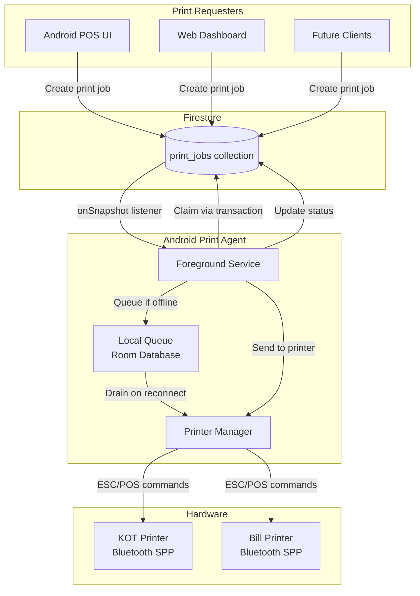
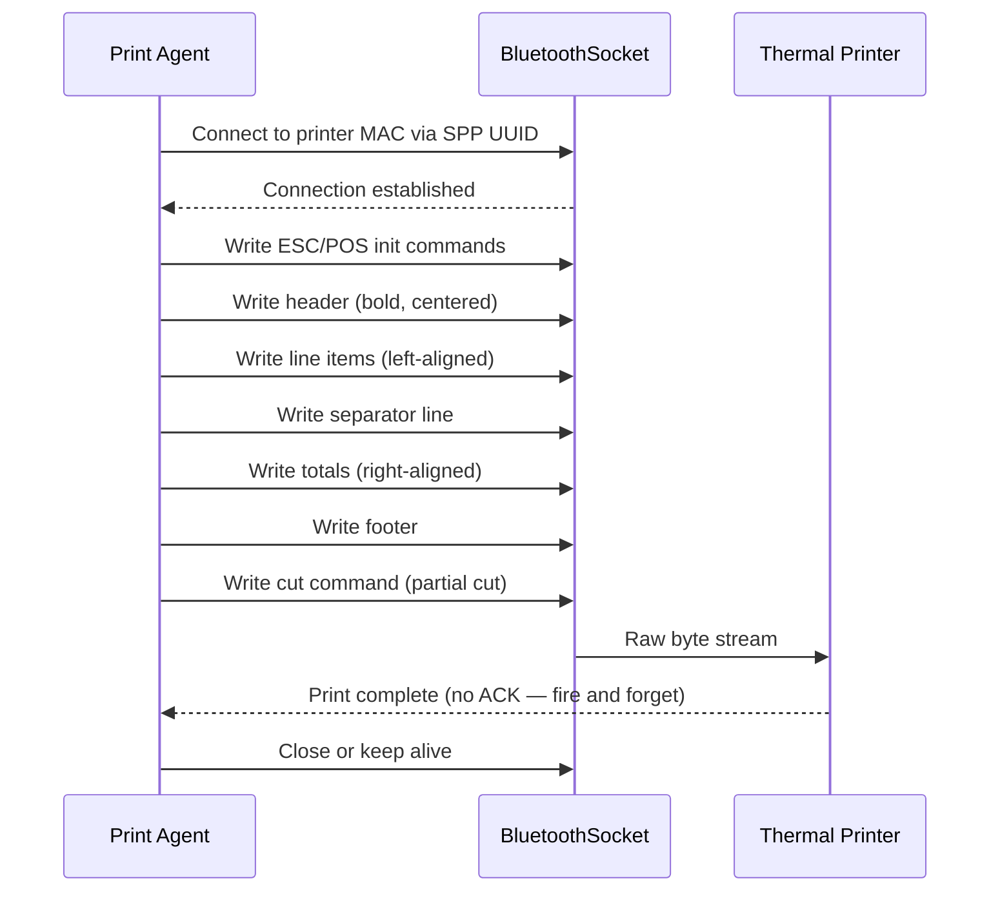
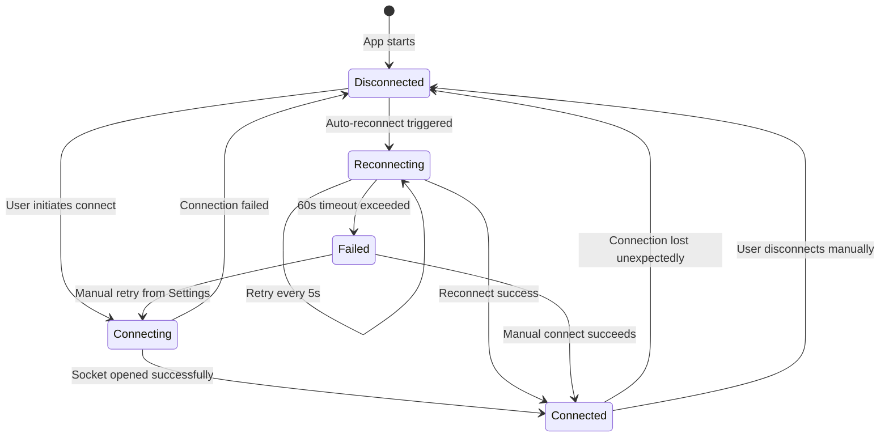
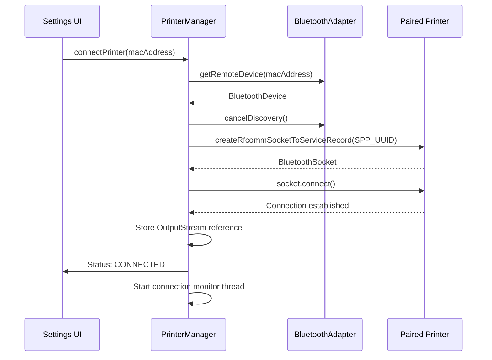
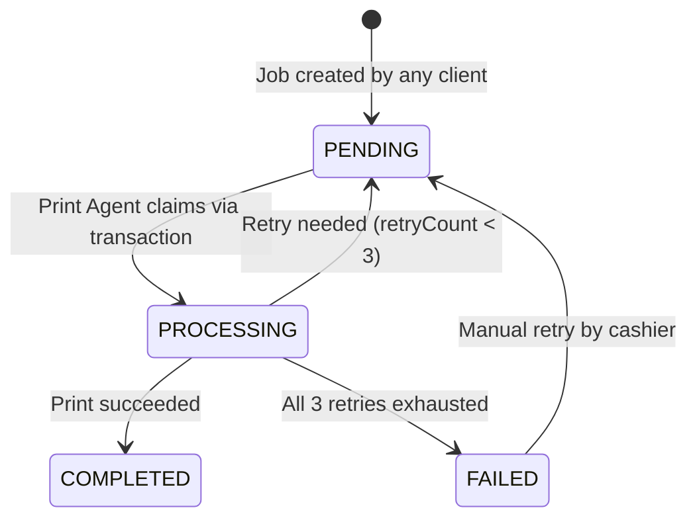
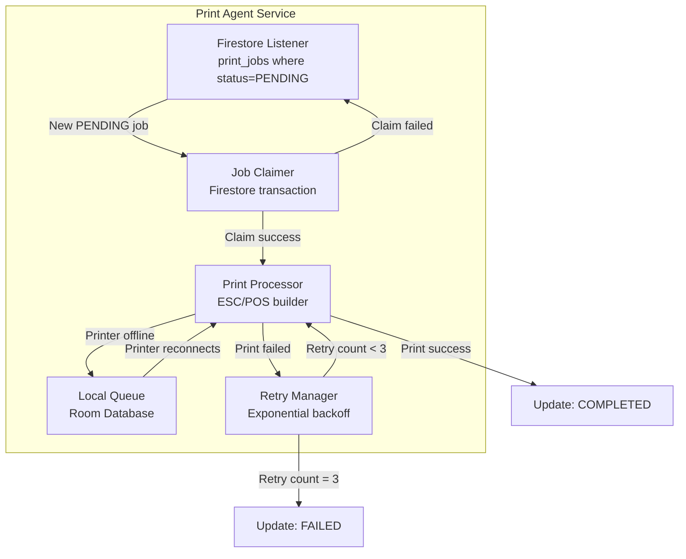
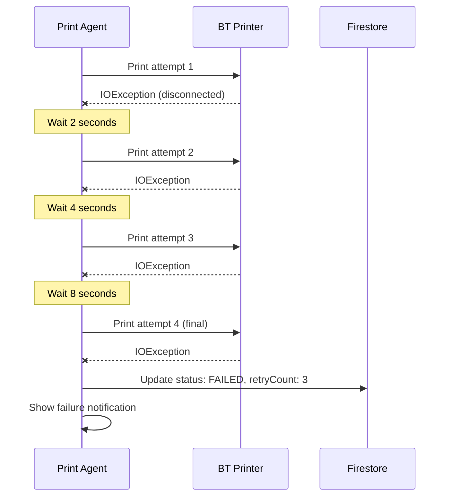
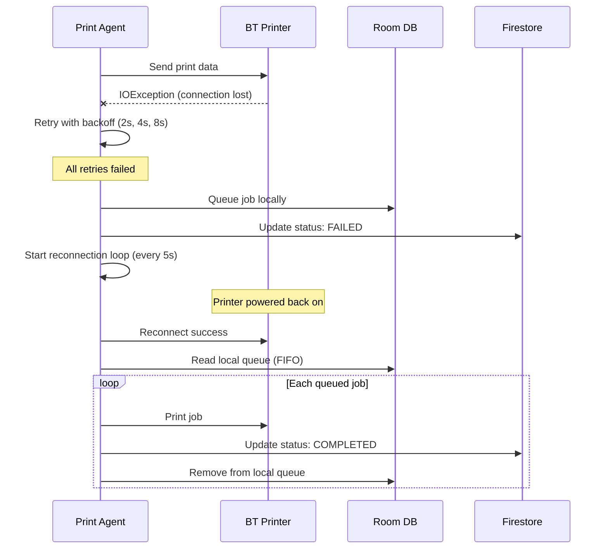

# Printing Architecture

## Overview

The Dajaj printing system uses a queue-based architecture where all print operations flow through Firestore. No client ever communicates directly with a Bluetooth printer. The Android POS runs a Print Agent as a Foreground Service that listens for pending print jobs and executes them via Bluetooth.



---

## Bluetooth Communication Protocol

### SPP (Serial Port Profile)

- **UUID:** `00001101-0000-1000-8000-00805F9B34FB` (standard SPP UUID)
- **Protocol:** ESC/POS commands over Bluetooth RFCOMM socket
- **Data format:** Byte arrays containing ESC/POS command sequences
- **Character encoding:** UTF-8 for text, raw bytes for control commands
- **Paper width:** 58mm or 80mm thermal paper (configured per printer)

### ESC/POS Command Flow



### Common ESC/POS Commands Used

| Command | Hex | Purpose |
|---------|-----|---------|
| Initialize | `0x1B 0x40` | Reset printer |
| Bold On | `0x1B 0x45 0x01` | Enable bold text |
| Bold Off | `0x1B 0x45 0x00` | Disable bold text |
| Center Align | `0x1B 0x61 0x01` | Center text alignment |
| Left Align | `0x1B 0x61 0x00` | Left text alignment |
| Right Align | `0x1B 0x61 0x02` | Right text alignment |
| Double Height | `0x1B 0x21 0x10` | Double-height text |
| Normal Size | `0x1B 0x21 0x00` | Normal text size |
| Line Feed | `0x0A` | New line |
| Partial Cut | `0x1D 0x56 0x01` | Cut paper (partial) |

---

## Connection Lifecycle

### Connect / Disconnect / Reconnect



### Connection Sequence



### Auto-Reconnection Strategy

| Parameter | Value |
|-----------|-------|
| Trigger | Unexpected disconnection (IOException on read/write) |
| Interval | 5 seconds between attempts |
| Maximum duration | 60 seconds total |
| Max attempts | 12 attempts (60s / 5s) |
| On success | Resume print queue processing |
| On timeout | Stop reconnection, set status "disconnected", show notification |
| Manual retry | Available from Printer Settings screen |

---

## Print Queue System

### Job States & Transitions



### Job Types

| Job Type | Printer Type | When Created |
|----------|-------------|--------------|
| `kot` | KOT printer | Order confirmed or pending order accepted |
| `customer_bill` | Bill printer | Order completed, bill generated |
| `reprint` | KOT or Bill | Manager triggers from Web Dashboard |

### Job Document Fields

```json
{
  "id": "pj_xyz789",
  "restaurantId": "dajaj_main",
  "jobType": "kot",
  "printerType": "kot",
  "status": "pending",
  "claimedBy": null,
  "orderId": "1045",
  "orderNumber": "1104260001",
  "payload": { "..." },
  "retryCount": 0,
  "failureReason": null,
  "source": "android_pos",
  "createdAt": "2024-01-15T14:30:00.000Z",
  "claimedAt": null,
  "completedAt": null
}
```

---

## Print Agent Design

### Foreground Service

The Print Agent runs as an Android Foreground Service with a persistent notification. It survives app screen closure and device sleep.



### Service Lifecycle

| Event | Behavior |
|-------|----------|
| App starts | Service starts, registers Firestore listener |
| App screen closed | Service continues running (foreground notification) |
| Device restarts | Service restarts via `BOOT_COMPLETED` BroadcastReceiver |
| Internet lost | Listener disconnects, local queue processes via Bluetooth |
| Internet restored | Listener re-establishes, sync pending statuses |
| User force-stops app | Service stops, resumes on next app open |

### Persistent Notification States

| State | Notification Text |
|-------|------------------|
| Idle | "Print Agent running — waiting for jobs" |
| Printing | "Printing Order #1045..." |
| Error | "Print failed — Order #1045 (tap to retry)" |
| Offline | "Print Agent running — offline mode" |

---

## Firestore Listeners

The Print Agent listens to a single query:

```kotlin
firestore.collection("print_jobs")
    .whereEqualTo("restaurantId", currentRestaurantId)
    .whereEqualTo("status", "pending")
    .addSnapshotListener { snapshots, error ->
        // Process new PENDING jobs
    }
```

### Listener Behavior

- Fires on any new document matching the query
- Fires on document returning to PENDING (manual retry)
- Only the **primary printer device** processes jobs
- Non-primary devices ignore the listener events

---

## Retry Mechanisms

### Print Retry (Exponential Backoff)

| Attempt | Delay | Total elapsed |
|---------|-------|---------------|
| 1st retry | 2 seconds | 2s |
| 2nd retry | 4 seconds | 6s |
| 3rd retry | 8 seconds | 14s |
| After 3rd failure | Mark as FAILED | — |



### Job Claim Retry (Fixed Interval)

| Parameter | Value |
|-----------|-------|
| Max attempts | 3 |
| Interval | 2 seconds (fixed) |
| On all failures | Skip job, wait for next |

### Printer Reconnection Retry

| Parameter | Value |
|-----------|-------|
| Interval | 5 seconds (fixed) |
| Duration | 60 seconds maximum |
| Total attempts | 12 |
| On timeout | Stop, mark disconnected |

### Order Sync Retry (WorkManager)

| Parameter | Value |
|-----------|-------|
| Max attempts | 5 |
| Backoff | Exponential, base 5 seconds |
| Constraint | Network available |

---

## Failure Recovery

### Scenario: Printer Disconnects Mid-Print



### Scenario: Internet Disconnects

1. Firestore listener disconnects
2. Print Agent switches to local-only mode
3. New orders saved to Room Database
4. Print jobs created in Room local queue
5. Agent prints from local queue via Bluetooth (still connected)
6. On internet restore: WorkManager syncs orders and print statuses to Firestore

### Scenario: App Crash / Device Restart

1. `BOOT_COMPLETED` receiver starts the Print Agent service
2. Agent checks Room DB for unsynced jobs (printed locally but not synced)
3. Agent reconnects to paired printers
4. Agent re-registers device in Firestore, updates heartbeat
5. Agent re-establishes `print_jobs` listener
6. Agent processes any unsynced local jobs first, then resumes normal operation

### Scenario: Manual Retry After FAILED

1. Cashier sees failed job notification on Android POS
2. Cashier taps retry (or uses the failed jobs list)
3. App updates job in Firestore: `status: "pending"`, `retryCount: 0`
4. Print Agent's listener detects the PENDING job
5. Normal claim → process flow resumes

---

## Duplicate Prevention

### 1. Firestore Transactions for Job Claiming

Only one device can claim a job. The transaction:
1. Reads current job status
2. Verifies it's still `PENDING`
3. Atomically sets `status: PROCESSING` and `claimedBy: deviceId`

If another device already claimed it, the transaction fails and the device skips the job.

```kotlin
firestore.runTransaction { transaction ->
    val jobRef = firestore.collection("print_jobs").document(jobId)
    val snapshot = transaction.get(jobRef)

    if (snapshot.getString("status") == "pending") {
        transaction.update(jobRef, mapOf(
            "status" to "processing",
            "claimedBy" to currentDeviceId,
            "claimedAt" to FieldValue.serverTimestamp()
        ))
        true // Claimed successfully
    } else {
        false // Already claimed by another device
    }
}
```

### 2. Device ID Verification

Before printing, the agent verifies `claimedBy` matches its own device ID.

### 3. Idempotent Status Updates

If the agent crashes after printing but before updating Firestore:
- On restart, it checks Room DB for jobs marked "printed locally"
- Syncs their COMPLETED status to Firestore
- Prevents reprinting the same job

### 4. Primary Printer Enforcement

Only the device with `isPrimaryPrinter: true` processes jobs from Firestore. Non-primary devices ignore PENDING jobs entirely.

### 5. Job Expiry (Future Enhancement)

Jobs in PROCESSING for >5 minutes without completion are released back to PENDING. This prevents stuck jobs when a device crashes after claiming but before printing.

---

## Local Queue (Room Database)

### Table: `local_print_queue`

| Column | Type | Description |
|--------|------|-------------|
| `id` | TEXT (PK) | Same as Firestore job ID |
| `jobType` | TEXT | kot, customer_bill, reprint |
| `printerType` | TEXT | kot, bill |
| `orderId` | TEXT | Order reference |
| `orderNumber` | TEXT | Order number |
| `payload` | TEXT (JSON) | Serialized print payload |
| `status` | TEXT | local_pending, printed, synced |
| `retryCount` | INTEGER | Local retry count |
| `createdAt` | INTEGER | Epoch timestamp |
| `printedAt` | INTEGER | When printed locally |

### Queue Limits

- Maximum: **500 print jobs** (configurable)
- When limit reached: Oldest completed jobs purged first
- If queue is full with pending jobs: Warning shown to cashier

### Drain Strategy

1. On printer reconnect: Process all `local_pending` jobs in FIFO order
2. Each job retried up to 3 times
3. Failed jobs skipped, continue with next
4. On internet reconnect: Sync all `printed` status to Firestore via WorkManager
