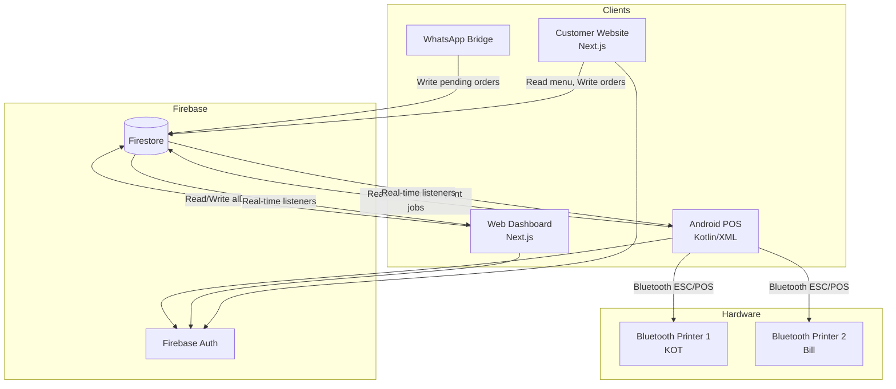
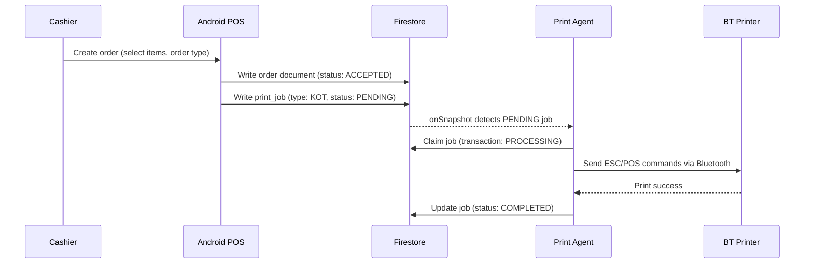
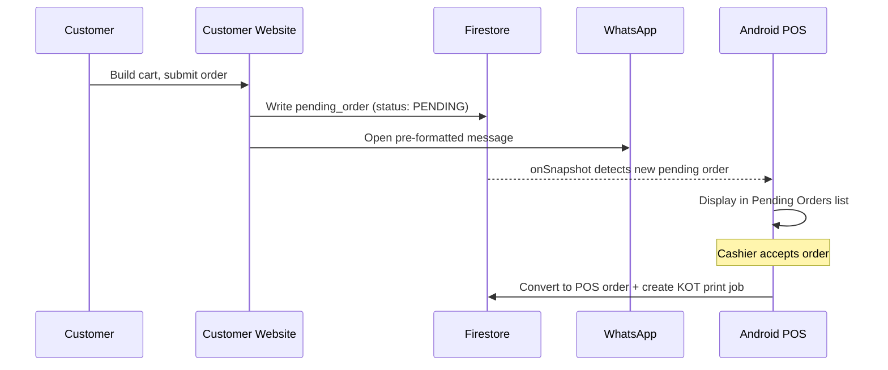
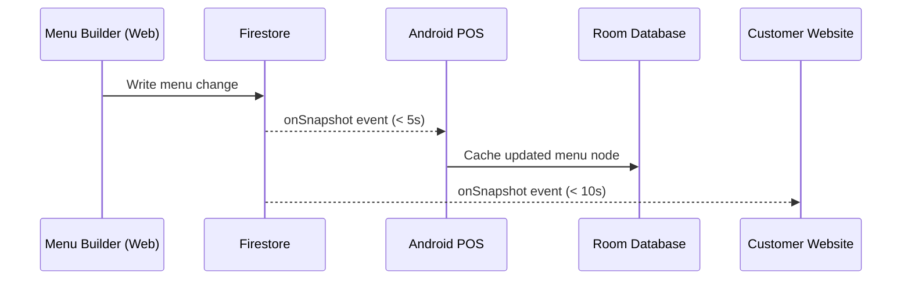
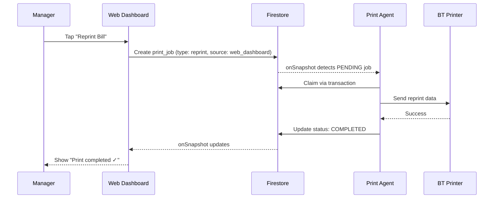
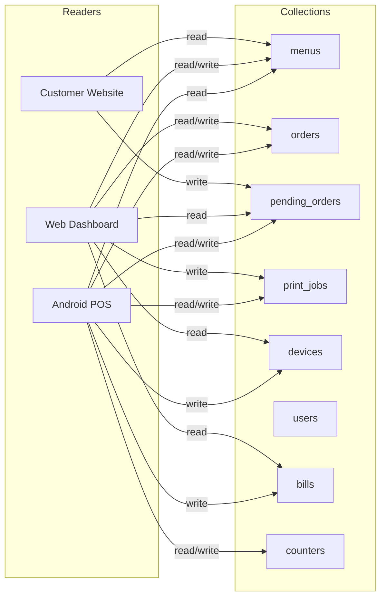
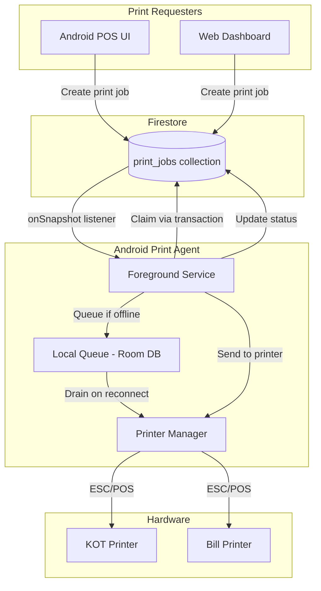

# System Architecture

## Overview

The Dajaj Ecosystem is a unified multi-channel restaurant platform. It consists of:

- **Android POS** — Native Kotlin app for cashier operations and Bluetooth printing
- **Web Dashboard** — Next.js app for menu management, inventory, reports, and administration
- **Customer Website** — Next.js app for browsing the menu, building carts, and ordering via WhatsApp
- **Firebase Firestore** — Real-time NoSQL database serving as the sole communication backbone
- **Bluetooth Thermal Printers** — KOT and customer bill printing via the Android Print Agent

All inter-client communication flows through Firestore. No client communicates directly with another.

---

## High-Level Architecture

---

## Component Boundaries

| Component | Technology | Responsibility |
|-----------|-----------|----------------|
| Android POS | Kotlin, XML, MVVM, Hilt, Room, Firebase | Cashier operations, Bluetooth printing, KOT workflow, offline mode |
| Web Dashboard | Next.js, React, Firestore SDK | Menu Builder, Inventory, Reports, Online Menu, Admin |
| Customer Website | Next.js, React | Browse menu, cart, order via WhatsApp |
| Firebase Firestore | Google Cloud Firestore | Real-time sync, security rules, inter-client communication |
| Firebase Auth | Firebase Authentication | User identity for all clients |
| Bluetooth Printers | ESC/POS thermal printers | KOT printing, customer bill printing |

---

## Data Flow Diagrams

### Order Creation (Walk-in)

### WhatsApp Order Flow

### Menu Synchronization

### Remote Printing (Manager on iPhone)

---

## User Flows

### Customer Flow

1. Browse menu on Customer Website
2. Add items to cart
3. Submit order → saved to Firestore as `pending_order`
4. WhatsApp opens with pre-formatted confirmation message
5. Order appears on Android POS for cashier acceptance

### Cashier Flow

1. Log in to Android POS via Firebase Auth
2. View Dashboard (pending order count, printer status, connectivity)
3. Create walk-in/takeaway orders from POS screen (3-panel layout)
4. Accept pending orders from WhatsApp/Website channels
5. Orders auto-generate KOT print jobs
6. Mark orders as READY when kitchen completes
7. Complete orders when customer picks up

### Manager Flow

1. Log in to Web Dashboard
2. Manage menu via Menu Builder (changes sync to all clients)
3. View unified reports (all channels aggregated)
4. Monitor pending orders and kitchen queue
5. Trigger remote reprints (flows through Firestore → Android Print Agent)
6. Monitor device status and printer health

---

## Firestore Interaction Overview

---

## Printing Architecture Overview

All printing goes through a Firestore-backed queue. No client ever communicates directly with a Bluetooth printer except the Print Agent running as a Foreground Service on the Android POS.

---

## Design Principles

1. **Firestore as Single Source of Truth** — No direct client-to-client communication.
2. **Offline-First Android** — POS operates during internet outages using Room Database.
3. **Print Queue Pattern** — All printing goes through Firestore queue; never print directly from UI.
4. **Clean Architecture** — Android follows MVVM + Clean Architecture with clear layer boundaries.
5. **Zero-Downtime Migration** — Web POS removed only after Android POS validated in production.

---

## Technology Stack Summary

| Layer | Technology |
|-------|-----------|
| Android UI | Kotlin, XML Layouts, ViewBinding, Material 3 |
| Android Architecture | MVVM, Clean Architecture, Hilt DI |
| Android Persistence | Room Database (SQLite) |
| Android Services | Foreground Service, WorkManager |
| Android Bluetooth | BluetoothSocket, SPP UUID |
| Web Frontend | Next.js, React, TypeScript |
| Backend | Firebase Firestore, Firebase Auth |
| Real-time Sync | Firestore onSnapshot listeners |
| Printing | ESC/POS commands over Bluetooth SPP |
